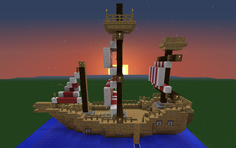
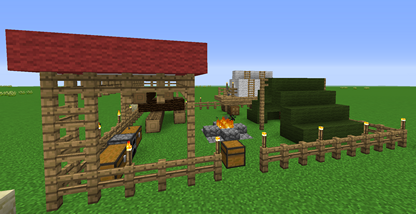
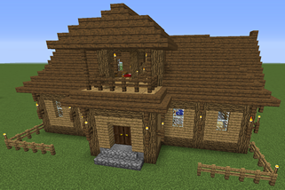

<strong>This is where you can find specific information about Buildings  that do not have a Worker associated to them.</strong>

<strong>&nbsp;&nbsp;&nbsp;&nbsp;There are several buildings that do not require a Worker for it, as in the case of the "Town Hall", the "Supply Ship", the "Supply Camp",  the "Citizen's Hut" and the "Warehouse" for now. There are other buildings that are being worked on that will have some Citizen and Player interaction in the Future, like the Marketplace, the Tavern/Inn, and more to come.</strong>

\\

<table>
<tr>
<td>

</td>
<td>
{{/Buildings/Ship.png|}}
</td>
<td>
&nbsp;&nbsp;&nbsp;&nbsp;&nbsp;&nbsp;&nbsp;&nbsp;
</td>
<td>
{{/Buildings/Camp.png|}}
</td>
<td>
&nbsp;&nbsp;&nbsp;&nbsp;&nbsp;&nbsp;&nbsp;&nbsp;
</td>
</tr>
</table>
<table>
<tr>
<td>

</td>
<td>[[Supply Ship| Supply Ship]]</td>
<td>
&nbsp;&nbsp;&nbsp;&nbsp;&nbsp;&nbsp;&nbsp;&nbsp;&nbsp;&nbsp;&nbsp;&nbsp;&nbsp;&nbsp;&nbsp;
</td>
<td>
&nbsp;&nbsp;&nbsp;&nbsp;&nbsp;&nbsp;&nbsp;&nbsp;&nbsp;&nbsp;&nbsp;&nbsp;&nbsp;&nbsp;&nbsp;&nbsp;
</td>
<td>&nbsp;&nbsp;&nbsp;&nbsp;&nbsp;&nbsp;&nbsp;&nbsp;&nbsp;&nbsp;&nbsp;&nbsp;&nbsp;&nbsp;&nbsp;&nbsp;[[Supply Camp|Supply Camp]]</td>
</tr>
</table>
<table>
<tr>
<td>

</td>
<td>
{{/Buildings/Town Hall.png|}}
</td>
<td>
&nbsp;&nbsp;&nbsp;&nbsp;&nbsp;&nbsp;&nbsp;&nbsp;
</td>
<td>
{{/Buildings/Citizen Hut.png|}}
</td>
<td>
&nbsp;&nbsp;&nbsp;&nbsp;&nbsp;&nbsp;&nbsp;&nbsp;
</td>
<td>
{{/Buildings/Warehouse.png|}}
</td>
<td>
&nbsp;&nbsp;&nbsp;&nbsp;&nbsp;&nbsp;&nbsp;&nbsp;
</td>
</tr>
</table>
<table>
<tr>
<td>

</td>
<td>[[Town Hall| Town Hall]]</td>
<td>
&nbsp;&nbsp;&nbsp;&nbsp;&nbsp;&nbsp;&nbsp;&nbsp;&nbsp;&nbsp;&nbsp;&nbsp;&nbsp;&nbsp;&nbsp;&nbsp;
</td>
<td>&nbsp;&nbsp;&nbsp;&nbsp;&nbsp;&nbsp;&nbsp;&nbsp;&nbsp;&nbsp;&nbsp;&nbsp;&nbsp;&nbsp;&nbsp;&nbsp;[[Citizen Hut| Citizen Hut]]</td>
<td>
&nbsp;&nbsp;&nbsp;&nbsp;&nbsp;&nbsp;&nbsp;&nbsp;&nbsp;&nbsp;&nbsp;&nbsp;&nbsp;&nbsp;&nbsp;&nbsp;
</td>
<td>&nbsp;&nbsp;&nbsp;&nbsp;&nbsp;&nbsp;&nbsp;&nbsp;&nbsp;&nbsp;&nbsp;&nbsp;&nbsp;&nbsp;&nbsp;&nbsp;[[Warehouse| Warehouse]]</td>
</tr>
</table>

_____________________________________

If changes are needed or I missed a new patch, let me know, so I can update this page.

You can also post bug reports [[http://www.minecolonies.com/publicforum/m/18051739/viewforum/6723571|HERE]]- Wissi

[[Welcome to the MineColonies Wiki|Back to Welcome Page]]

{| class="wikitable" style="width: 90%;margin: auto;"
! colspan="4" |'''Building Schematic Details'''
|-
| valign="top" | '''Wooden (Oak) Style'''
*[[Supply Camp]]
*[[Supply Ship]]
*[[Oak Baker]]
*[[Oak Barracks]]
*[[Oak Barracks Tower]]
*[[Oak Builder]]
*[[Oak Citizens Hut]]
**[[AlternativeWood Citizens Hut]]
*[[Oak Cook]]
*[[Oak Deliveryman]]
*[[Oak Farmer]]
*[[Oak Fisherman]]
*[[Oak Guard Tower]]
*[[Oak Lumberjack]]
*[[Oak Miner]]
*[[Oak TownHall]]
*[[Oak WareHouse]]
| valign="top" |'''Birch Style'''
*[[Birch Animal Farmer]]
*[[Birch Baker]]
*[[Birch Barracks]]
*[[Birch Barracks Tower]]
*[[Birch Builder]]
*[[Birch Citizens Hut]]
*[[Birch Cook]]
*[[Birch Deliveryman]]
*[[Birch Farmer]]
*[[Birch Fisherman]]
*[[Birch GuardTower]]
*[[Birch Lumberjack]]
*[[Birch Miner]]
*[[Birch Restaurant]]
*[[Birch Town Hall]]
*[[Birch WareHouse]]
**[[Birch Wall Corner]]
**[[Birch Wall Gate]]
**[[Birch Wall]]
**[[Birch Wall Stairs]]
| valign="top" |'''Stone'''
*[[Stone Baker]]
*[[Stone Builder]]
*[[Stone Citizens Hut]]
**[[AlternativeStone Citizens Hut]]
*[[Stone Cook]]
*[[Stone Farmer]]
*[[Stone Fisherman]]
*[[Stone Lumberjack]]
*[[Stone Miner]]
| valign="top" |'''Mesa'''
*[[Mesa Baker]]
*[[Mesa Builder]]
*[[Mesa Citizens Hut]]
*[[Mesa Deliveryman]]
*[[Mesa Farmer]]
*[[Mesa Fisherman]]
*[[Mesa Guard Tower]]
*[[Mesa Lumberjack]]
*[[Mesa Miner]]
*[[Mesa Town Hall]]
*[[Mesa WareHouse]]

|-
| valign="top" |'''Sandstone'''
*[[Sandstone Baker]]
*[[Sandstone Builder]]
*[[Sandstone Citizens Hut]]
*[[Sandstone Deliveryman]]
*[[Sandstone Farmer]]
*[[Sandstone Fisherman]]
*[[Sandstone Guard Tower]]
*[[Sandstone Lumberjack]]
*[[Sandstone Miner]]
*[[Sandstone Town Hall]]
*[[Sandstone WareHouse]]

| valign="top" |'''Taiga'''
*[[Taiga Baker]]
*[[Taiga Barracks]]
*[[Taiga Barracks Tower]]
*[[Taiga Builder]]
*[[Taiga Citizens Hut]]
*[[Taiga Deliveryman]]
*[[Taiga Farmer]]
*[[Taiga Fisherman]]
*[[Taiga Guard Tower]]
*[[Taiga Lumberjack]]
*[[Taiga Miner]]
*[[Taiga Town Hall]]
*[[Taiga WareHouse]]

| valign="top" |'''Infrastructure'''
*[[Inf Basic Bridge]]
*[[Inf Nice Lamp Post]]
*[[Inf Oak Bridge Span]]
*[[Inf Oak Bridge Stairs]]
*[[Inf Poor Lamp Post]]
*Roads
**[[Inf Basic Path]]
**[[Inf Fancy Corner]]
**[[Inf Fancy Intersection]]
**[[Inf Fancy Path]]
**[[Inf Fancy T Junction]]
**[[Inf Nice Corner]]
**[[Inf Nice Intersection]]
**[[Inf Nice Path]]
**[[Inf Nice T Junction]]
**[[Inf Poor Corner]]
**[[Inf Poor Intersection]]
**[[Inf Poor T Junction]]
**[[Inf Simple Intersection]]
**[[Inf Simple Path]]
**[[Inf Simple T Junction]]

| valign="top" |'''Miner'''
*[[Miner MainShaft]]
*[[Miner X2Left]]
*[[Miner X2Right]]
*[[Miner X2Top]]
*[[Miner X3LeftRight]]
*[[Miner X3TopRight]]
*[[Miner X4]]
|}
