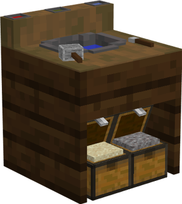
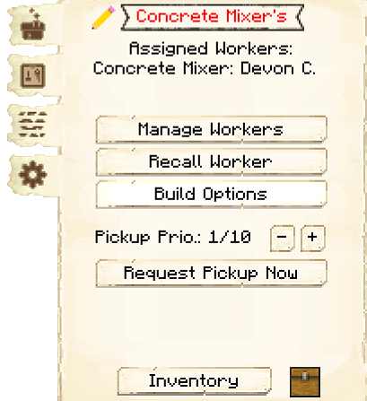
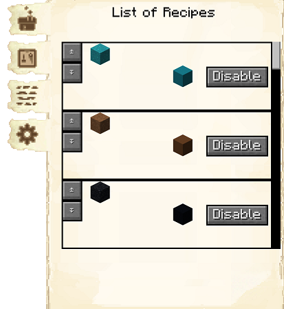
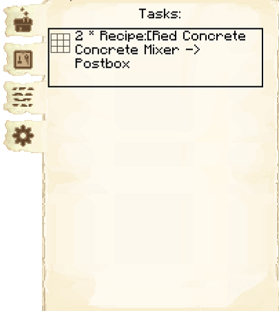
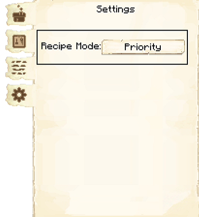

# Concrete Mixer

    
    

    

        

        
<strong>Worker:</strong>

        

        

        
<a href="../workers/concretemixer">Concrete Mixer</a>

        

    

    

    <recipe>concretemixer</recipe>

### Note: The Concrete Mixer's Hut cannot be built until you have a level 1 [Crusher's Hut](../../source/buildings/crusher) and have finished the [research](../../source/systems/research) in the [University](../../source/buildings/university).
 

The Concrete Mixer will craft all types of concrete powder and place them in flowing water (built in to their hut), then mine the resulting concrete. The Concrete Mixer will only make concrete and concrete powder when they receive a request for a block and have the needed materials. (All their recipes are pretaught.)

## Concrete Mixer's Hut GUI

When accessing the Concrete Mixer's Hut by right-clicking on it, you will see a GUI with different options.   You start on the main tab:

 

  

    
  

  

     
    <ul>
      
        <li><strong>{{ item.button }}:</strong> {{ item.content }}</li>
      
    </ul>
  

  
  
 

    

      
    

    

    
The second tab of the GUI is <strong>List of Recipes</strong>. Here you can see all the crafting recipes this hut knows.  The arrows allow you to move them up or down in priority.  You are also able to disable specific recipes.

    

  
 

    

      
    

    

    
The third tab of the GUI is <strong>Tasks</strong>.  This tab shows you any requests the hut is working on, and where it is going.

    

  
 

    

      
    

    

    
The fourth tab of the GUI is <strong>Settings</strong>.

      <li><strong>Recipe Mode:</strong>  This is unlocked by researching Warehouse Master in the University.  This allows you to change the order the hut chooses when it knows more than one recipe for an item. 
        <ul>
          <li><strong>Priority:</strong>  This is the default setting.  The hut will try to use the recipe that is higher up in their recipe list first.</li>
          <li><strong>Warehouse Stock:</strong> The hut will look in the warehouse first to see what resource you have more of before deciding what recipe it will use.</li>
        </ul>
     </li>
    

