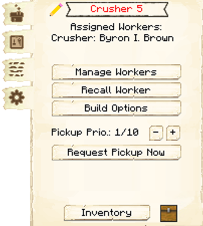
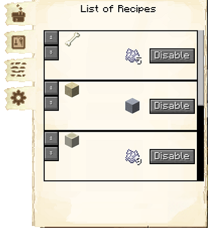
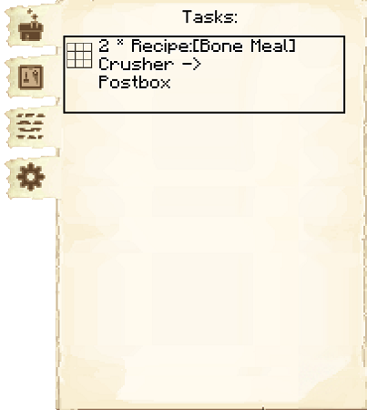
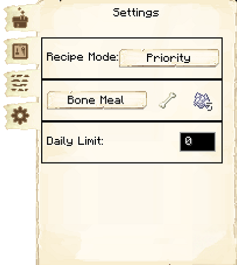

# Crusher's Hut

    
    

    

        

        
<strong>Worker:</strong>

        

        

        
<a href="../workers/crusher">Crusher</a>

        

    

    

    <recipe>crusher</recipe>

### Note: The Crusher's Hut cannot be built until you have a level 1 [Stonemason's Hut](../../source/buildings/stonemason) and have finished the research in the [University](../../source/buildings/university).
 

The Crusher's Hut is where the Crusher will take items and crush them into other blocks. The defaults are: 

| Starting Item | Created Item |
| ----- | ----- |
| Bone          | Bonemeal     |
| Bone Block    | Bonemeal     |
| Cobblestone   | Gravel (chance to get flint) |
| Clay          | Clay Ball    |
| Gravel        | Sand         |
| Sand          | Clay         |

Note: By default the Crusher's ratio is 2:1, but there is a [research](../../source/systems/research) in the [University](../../source/buildings/university) to make them work on a 1:1 ratio.

The higher the level of the Crusher's Hut, the more daily output the Crusher can handle. So:

| Building Level | Daily Max |
| ----- | ----- |
| 1 | 16  |
| 2 | 64  |
| 3 | 144 |
| 4 | 256 |
| 5 | 999 |

## Crusher's Hut GUI

When accessing the Crusher's Hut block by right-clicking on it, you will see a GUI with different options.   You start on the main tab:

 

  

    
  

  

     
    <ul>
      
        <li><strong>{{ item.button }}:</strong> {{ item.content }}</li>
      
    </ul>
  

 

    

      
    

    

    
Clicking on the blue arrow on the first page will bring you to <strong>Missing</strong>. Here you can set what you want the Crusher to crush and how many blocks per day. (See the above lists.) Be sure to click save at the bottom after you make changes.

    

 

    

      
    

    

    
The second tab of the GUI is <strong>List of Recipes</strong>. Here you can see all the crafting recipes this hut knows.  The arrows allow you to move them up or down in priority.  You are also able to disable specific recipes.

    

 

    

      
    

    

    
The third tab of the GUI is <strong>Tasks</strong>.  This tab shows you any requests the hut is working on, and where it is going.

    

  
 

    

      
    

    

    
The fourth tab of the GUI is <strong>Settings</strong>.

      <ul>
      <li><strong>Recipe Mode:</strong>  This is unlocked by researching Warehouse Master in the University.  This allows you to change the order the hut chooses when it knows more than one recipe for an item. 
        <ul>
          <li><strong>Priority:</strong>  This is the default setting.  The hut will try to use the recipe that is higher up in their recipe list first.</li>
          <li><strong>Warehouse Stock:</strong> The hut will look in the warehouse first to see what resource you have more of before deciding what recipe it will use.</li>
        </ul>
      </li>
      </ul>
    

