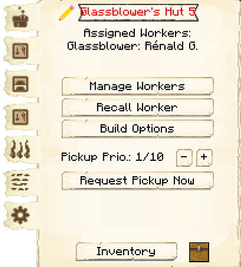
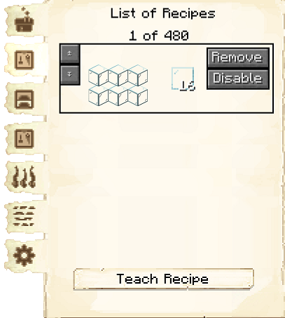

# Glassblower's Hut

    
    

    

        

        
<strong>Worker:</strong>

        

        

        
<a href="../workers/glassblower">Glassblower</a>

        

    

    

    <recipe>glassblower</recipe>

### Note: The Glassblower's Hut cannot be built until you have a level 3 [Smeltery](../../source/buildings/smeltery) (or three level 1 Smelteries, or another equivalent) and have finished the research in the [University](../../source/buildings/university).
 

The Glassblower's Hut is where the Glassblower will smelt sand into glass and make glass panes from glass blocks. For the Glassblower to work, they must receive a request from another worker and have the necessary materials, including fuel if they're smelting sand into glass. The Glassblower's Hut must also have been taught the crafting recipe for glass panes.

**Hint:** The number of recipes you can teach the Glassblower's Hut doubles per building level. So:

| Glassblower's Hut Level | Number of Recipes |
| :-----: | :-----: |
| 1 | 10 | 
| 2 | 20 |
| 3 | 40 |
| 4 | 80 | 
| 5 | 160 | 

 

**Hint:** The higher the level of the Glassblower's Hut, the more furnaces the Glassblower will have available. The number of furnaces they *use* depends on their Creativity level. So:

| Building Level |  Furnaces |
| :-----: | :-----: | 
| 1 |  1 |
| 2 |  2 |
| 3 |  3 |
| 4 |  4 |
| 5 |  5 |

**Hint:** The higher the Glassblower's Focus level, the faster things will smelt. At high levels, they can go *much* faster than the player!

## Glassblower's Hut GUI

When accessing the Glassblower's Hut block by right-clicking on it, you will see a GUI with different options:

  

    
  

  

     
    <ul>
      
        <li><strong>{{ item.button }}:</strong> {{ item.content }}</li>
      
    </ul>
  

   

Listed on page two of the GUI are items that can be used by the Glassblower as fuel in their furnaces. Turn on any that you want your Glassblower to use, and a Courier will deliver those items to the Glassblower when they need fuel. (The black box at the top is to search for items.)

 
