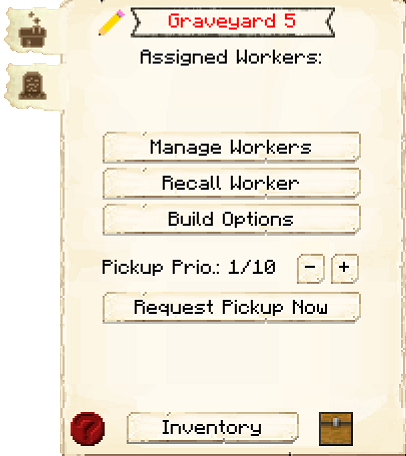
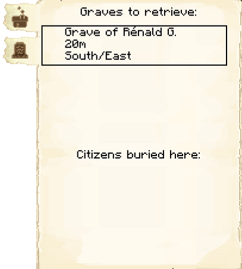

# Graveyard

    
    

    

        

        
<strong>Worker:</strong>

        

        

        
<a href="../workers/undertaker">Undertaker</a>

        

    

    

    <recipe>graveyard</recipe>

### Note: The Graveyard cannot be built until you have finished the [research](../../source/systems/research) in the [University](../../source/buildings/university).
 

The Graveyard is where the Undertaker will bury your deceased citizens.
For more information, see the [Undertaker](../../source/workers/undertaker) page.

The recommended maximum grave count per Graveyard level is below. This is **not mandatory**, and the actual amount will vary between styles.

| Graveyard Level | Number of Graves |
| --------------- | ---------------- |
| 1 | 14 | 
| 2 | 18 |
| 3 | 27 |
| 4 | 36 |
| 5 | 50 |

## Graveyard GUI

When accessing the Graveyard's hut block by right-clicking on it, you will see a GUI with different options:

 

  

    
  

  

     
    <ul>
      
        <li><strong>{{ item.button }}:</strong> {{ item.content }}</li>
      
    </ul>
  

  
This is page two of the Graveyard GUI. It has a list of the graves the Undertaker needs to recover.

 

  

    
  

    
  This is page three of the Graveyard GUI. It has a list of currently-buried citizens.

 

  

    
  

