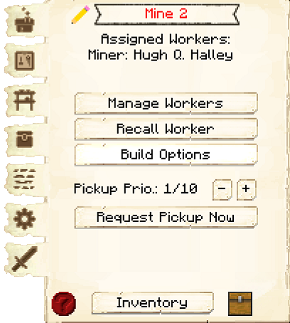
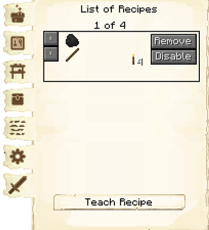
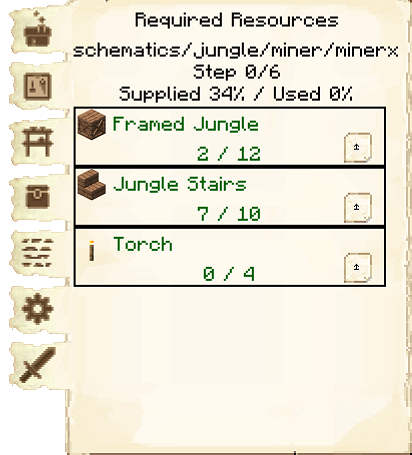
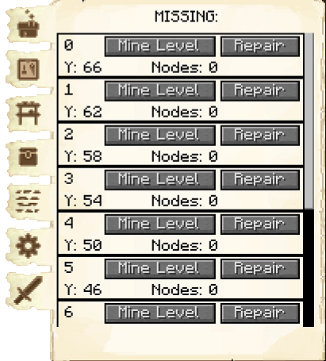
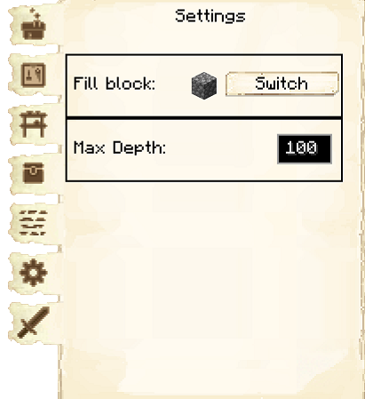

# Mine


The Mine is where you can hire a [Miner](../../source/workers/miner) to work the mine, or a [Quarrier](../../source/workers/quarrier) to work the [Quarry](../../source/buildings/quarry). At the mine, the Miner will mine for ores and materials. Once they are hired, the Miner will create a shaft downward and then branch out.

**Hint:** The shaft the Miner creates downwards will go to a specific depth depending on the level of the Mine:

| Mine Level | Shaft Y Level | Shaft Y Level |
| ---------- | ------------- | ------------- |
| | 1.16 | 1.18 |
| 1 | 50 | 40 |
| 2 | 30 | 20 |
| 3 | Bedrock | 0 |
| 4 | | Bedrock |






## Mine GUI

  

    
    When accessing the Mine's hut block by right-clicking on it, you will see a GUI with different options:  

    

      

        
      

      

         
        <ul>
          
            <li><strong>{{ item.button }}:</strong> {{ item.content }}</li>
          
        </ul>
      

    
  

    This is page two of the Mine's GUI.  

    

      

        
      

      

        <ul>
            <li><strong>List of Recipes:</strong> Simply lists all the recipes you've already taught the Mine. There's also a button to teach another.</li> 
        </ul>
      

    

    This is page three of the Mine's GUI.  

    

      

        
      

      

        <ul>
            <li><strong>Minimum Stock: </strong> Use this button to tell the Mine to keep a minimum stock on hand. Set items will be displayed above the button.</li>
        </ul>
      

    

    This is page four of the Mine's GUI.  

    

      

        
      

      

        <ul>
            <li><strong>Required Resources:</strong> Shows the resources needed to build the next shaft area.</li> 
        </ul>
      

    
  

    This is page five of the Mine's GUI.  

    

      

        
      

      

        <ul>
            <li><strong>Levels:</strong> The level refers to the platforms the Miner will place every 3 blocks down. Here you can assign what level of the Mine the Miner will create their mineshafts (nodes). If a level has a red number next to it, that means the Miner is currently mining that level. The Miner will ignore orders to mine at a specific level until the entire mineshaft is completed to the maximum depth their hut's level allows. You can also click Repair, to tell the Miner to restore that level to its original state. This can be useful if a fire breaks out in the mineshaft.</li> 
        </ul>
      

    

    This is page six of the Mine's GUI.  

    

      

        
      

      

        <ul>
            <li><strong>Guards:</strong> Here is where you can assign <a href="../../source/workers/guard">Guards</a> to patrol this Mine. If assigned, they will patrol the level the Miner is currently mining at, to help protect them from hostile mobs. Only Guards set to the Patrol Mine task will show up here; tasks can be set in the <a href="../../source/buildings/guardtower">Guard Tower</a> GUI (<a href="../../source/buildings/barrackstower">Barracks Towers</a> do not have the Patrol Mine task). One Guard can be assigned at Mine levels 1 and 2, two Guards can be assigned at Mine levels 3 and 4, and three Guards can be assigned at Mine level 5.</li> 
        </ul>
      

    

      
       
  

