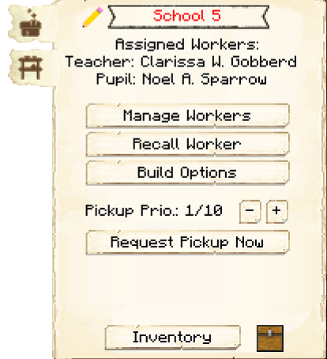

# School


### Note: The School cannot be built until you finish the research in the [University](../../source/buildings/university).
 

The School is where the Teacher will level up the Pupils' (children) skills. Paper will increase the leveling speed of the Pupils. 

The level of the School determines how many Pupils can be taught at a time.

| School Level | Pupils Taught |
| ----- | ----- |
| 1 | 2 |
| 2 | 4 |
| 3 | 6 |
| 4 | 8 |
| 5 | 10 |  






## School GUI

When accessing the School's hut block by right-clicking on it, you will see a GUI with different options:

  

    
  

  

     
    <ul>
      
        <li><strong>{{ item.button }}:</strong> {{ item.content }}</li>
      
    </ul>
  

   

This is page two of the School GUI.

    

        
    

    

        <ul>
        <li><strong> Minimum Stock: </strong> Use this button to tell the School to keep a minimum stock on hand. Set items will be displayed above the button.</li>
        </ul>
    

