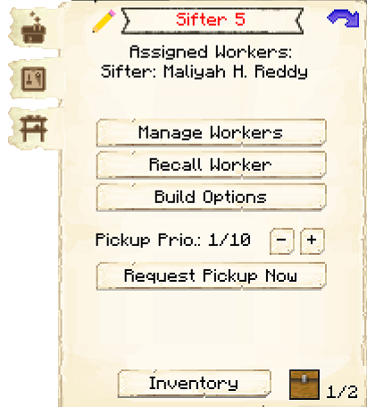
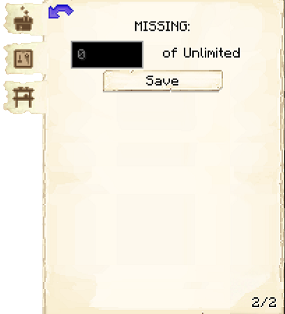

# Sifter's Hut


### Note: The Sifter's Hut cannot be built until you have a level 3 [Fisher's Hut](../../source/buildings/fisher) (or three level 1 Fisher's Huts, or another equivalent) and have finished the research in the [University](../../source/buildings/university).
 

The Sifter's Hut is where the Sifter will sift through dirt, gravel, sand, or soul sand to find loot. Doing this will make the block the Sifter is sifting disappear. 

| Sifted Block| Chance for |
| ----- | ----- |
| Dirt |	Beetroot seeds
| Dirt |	Carrots
| Dirt |	Melon seeds
| Dirt |	Potatoes
| Dirt |	Pumpkin seeds
| Dirt |	Oak saplings
| Dirt |	Spruce saplings
| Dirt |	Birch saplings
| Dirt |	Jungle saplings
| Dirt |	Acacia saplings
| Dirt |	Dark oak saplings
| Dirt |	Wheat seeds
| Gravel |	Coal
| Gravel |	Diamonds
| Gravel |	Lapis lazuli
| Gravel |	Emeralds
| Gravel |	Flint
| Gravel |	Gold ingots
| Gravel |	Iron ingots
| Gravel |	Iron nuggets
| Gravel |	Redstone
| Sand |	Cacti
| Sand |	Cocoa beans
| Sand |	Gold nuggets
| Sand |	Sugarcane
| Soul Sand |	Blaze powder
| Soul Sand |	Glowstone dust
| Soul Sand |	Magma cream
| Soul Sand |	Nether wart
| Soul Sand |	Quartz
| Soul Sand |	Human skulls

You can choose between four meshes. The higher the level of the mesh, the higher the likelihood that the Sifter will find loot.

| Hut Level | Mesh Available | 
| ----- | ----- | 
| 1         | String         | 
| 3         | Flint          | 
| 4         | Iron           | 
| 5         | Diamond        | 






## Sifter Hut GUI

When accessing the Sifter's Hut block by right-clicking on it, you will see a GUI with different options:

 

  

    
  

  

     
    <ul>
      
        <li><strong>{{ item.button }}:</strong> {{ item.content }}</li>
      
    </ul>
  

   
This is page two of the Sifter's Hut GUI.
 

  

    
  

  

    <ul>
     <li><strong>Block: </strong>You can choose what block you want the Sifter to sift by clicking on the button. The blocks to choose from are dirt, gravel, sand, and soul sand, however you can change this in the <a href="../../source/misc/configfile">config file</a>. If you change this, you must click save.</li>
     <li><strong>Amount: </strong>You can choose how many blocks are sifted daily. The max number is based on the level of the Sifter's Hut. If you change this, you must click save.</li>
     <li><strong>Meshes: </strong>You can purchase different levels of meshes, and each level has a higher likelihood of getting loot. If you have string, flint, iron ingots, or diamonds in your inventory, you will see the buy option beside the mesh type. If a mesh is in green, like string is in this picture, it means that mesh is the one the Sifter will use. You can only use one mesh at a time.</li>
    </ul>
  

  
