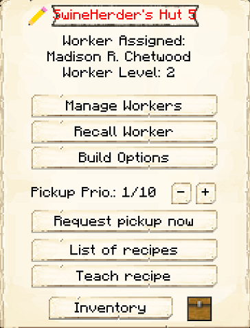
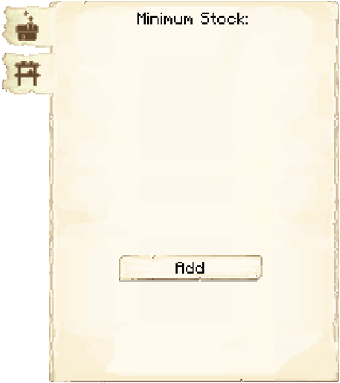

# Swineherd's Hut


The Swineherd's Hut is where the Swineherd will breed and butcher pigs for food. You will have to capture and bring in two pigs to the Swineherd's Hut, as the Swineherd will not catch and bring in any pigs.

**Note:** The Swineherd will only keep two pigs alive per hut level, so at level 5 they will have ten pigs in their holding pens to breed and butcher. This means they will be faster at producing and collecting meat. So:

| Building Level | Pigs Housed |
| ----- | ----- |
| 1 | 2 |
| 2 | 4 |
| 3 | 6 |
| 4 | 8 |
| 5 | 10 |






## Swineherd's Hut GUI

When accessing the Swineherd's Hut block by right-clicking on it,  you will see a GUI with different options:

  

    
  

  

      
     <ul>
      
        <li><strong>{{ item.button }}:</strong> {{ item.content }}</li>
      
    </ul>
  

   

This is page two of the Swineherd's Hut GUI.

    

        
    

    

        <ul>
        <li><strong> Minimum Stock: </strong> Use this button to tell the Swineherd's Hut to keep a minimum stock on hand. Set items will be displayed above the button.</li>
        </ul>
    

