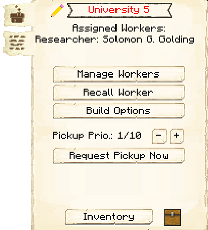
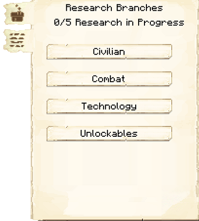

# University


The University is where a Researcher will research various upgrades to your colony.

As you level up the University, you can hire more researchers:

| Max Researchers | University Level |
| --------------- | ---------------- |
| 1 | 1 |
| 2 | 2 |
| 3 | 3 |
| 4 | 4 |
| 5 | 5 |

Once you click on a research tree, you will see the options for each research branch. Each option will tell you the requirements and how long it takes to research that option. The time is real-world time spent in-game. However, Researchers will sometimes use offline time to work on researches. Researchers' Knowledge skill affects the amount of research time they get from the offline time (it's not a 1:1 ratio), and their Mana skill affects the max amount of research time they can get. Offline research time is unlocked at University level 3. 






## University GUI

When accessing the University's hut block by right-clicking on it, you will see a GUI with different options:

 

  

    
  

  

     
    <ul>
      
        <li><strong>{{ item.button }}:</strong> {{ item.content }}</li>
      
    </ul>
  

 

 

Page 2 of the GUI will show you the options for each research tree.

  

    
  

    
 

To see a description of each of the researches, please visit the [Research System](../../source/systems/research) page.
