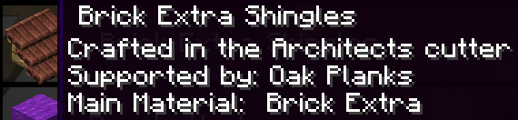
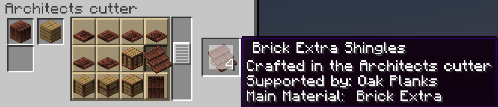
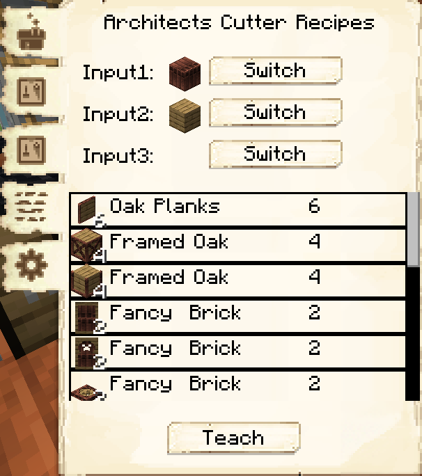

# Domum Ornamentum
 

Domum Ornamentum, or DO, is a dependency of MineColonies (1.17+ only) that adds combinatorial crafting of ornamental blocks. With it, you can combine almost any 1-3 full blocks to create framed blocks, shingles, pillars, doors, and many more!

One block gives a few options, but you can combine up to three blocks together.
Given that Minecraft has quite a few blocks, and you do "quite a few" x "quite a few" x "quite a few" x "however many block options for one block" x "however many block options for two blocks" x "however many block options for three blocks".
In case of the most detailed blocks, this results in over 16 million blocks!

To start, you need to craft an Architect's Cutter.

    

    <recipe>architect_cutter</recipe>

The easiest way to find the materials you need is to hover your mouse over the the image of the requested item. This will bring up an information box, telling you the name of the item, that it is crafted in the Architect's Cutter, the main material, and the support material(s).

When you have that information, you can put the materials in the Architect's Cutter. Once you have the materials in place, click on the image of the item in the middle section of the Cutter's GUI, and it will show that item in the output box. Check carefully to make sure the output matches EXACTLY the required materials from the request. Take special care matching the support materials as any differences in materials means your colonists won't use the item you craft, and some of the supporting materials aren't visible from the output preview.

When you have crafters, e.g. a [Sawmill](../../source/buildings/sawmill), up and running, you can then teach them the recipe by choosing the "custom recipe" tab and putting it in there.
Input 1 is the top left slot of the cutter, input 2 is the top right, and input 3 the bottom left slot in the cutter. When you have put the items in the slots, you will see various items below the input slots. The crafter can create ALL of those items from the recipe you have input. Make sure you teach the recipe to the appropriate crafter, though!

