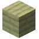
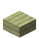
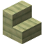
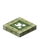
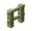

# Cactus Planks

     
     
     
     
     
     
     
    <recipe>cactus_planks</recipe>
    <recipe>cactus_slab</recipe>
    <recipe>cactus_stairs</recipe>
    <recipe>cactus_door</recipe>
    <recipe>cactus_trapdoor</recipe>
    <recipe>cactus_fence</recipe>
    <recipe>cactus_fence_gate</recipe>

 

Structurize adds cactus planks, as well as stairs, slabs, doors, trapdoors, fences, and fence gates created from them. They have no special use and are intended for decoration.

## Using Cactus Planks and Variants

Use cactus planks and their variants as you would use normal wooden planks - to decorate!
