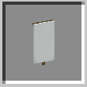

# Colony Banner

    

    <recipe>colonybanner</recipe>

 

The Colony Banner is a banner that uses the design set in the [Town Hall](../../source/buildings/townhall). Your [Knights](../../source/workers/guard) will wear the design on their shields, and it is also used in some schematics.
 
