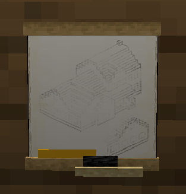
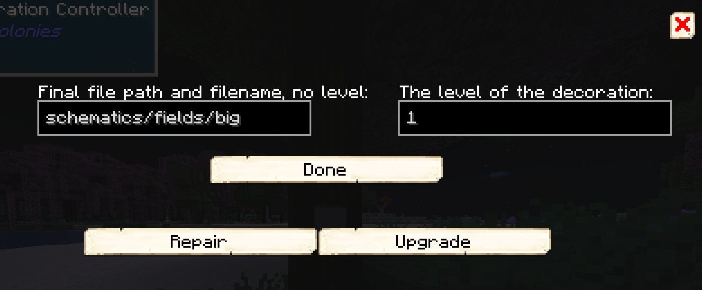

# Decoration Controller

    

 

The decoration controller is used to create custom [Schematics](../tutorials/schematics). See the Schematics page for how they're used.

The decoration controller is only available through creatively giving it to yourself. It cannot be crafted.

 

## Using the Decoration Controller

To use the decoration controller, right-click on it to bring up the GUI.

You can repair or upgrade decorations from the GUI, assuming that the decoration can be upgraded.
