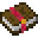

# Enchantments

    

    There is no recipe for the Raider's Bane enchant. It must be obtained from the Enchanter.

 

MineColonies adds one new enchantment, Raider's Bane. It can be applied to weapons (swords and axes) and increases the weapon's damage against MineColonies raiders. It goes up to level 2 and can be obtained from the [Enchanter](../../source/workers/enchanter) when their [tower](../../source/buildings/enchantertower) is level 3+. (For them to obtain a level 2 Raider's Bane enchant, their hut must be level 5.)
