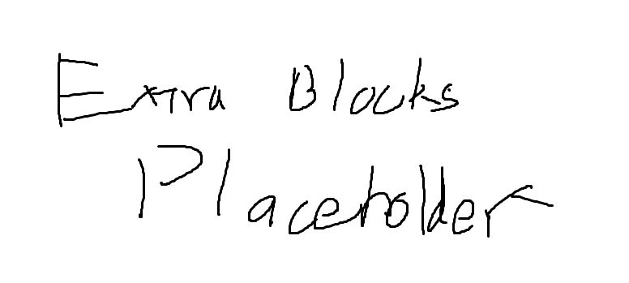

# "Extra" Blocks  

    

    <recipe>brickextra</recipe>
    <recipe>cactusextra</recipe>
    <recipe>cobblestoneextra</recipe>
    <recipe>mossycobblestoneextra</recipe>
    <recipe>paperextra</recipe>
    <recipe>wheatextra</recipe>

 

"Extra" blocks are used for decoration. They can be crafted manually or at various crafters. The dyed version of each block is the same recipe except the middle item (i.e., row 2, item 2) is replaced by the appropriate dye.
 

| Extra Block       | Crafter             |
| ----------------- | ------------------- |
| Brick             |             |
| Cactus            |  or Stonemason |
| Cobblestone       | Stonemason                                |
| Mossy Cobblestone | Stonemason                                |
| Paper             |             |
| Wheat             |  or Stonemason  |
