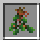

# Mistletoe

    

    There is no recipe for Mistletoe.

 

Mistletoe is an item that [Alchemists](../../source/workers/alchemist) can gather randomly with shears.
 

## Using the Mistletoe

Mistletoe is used by Alchemists to craft magic potions for [Druids](../../source/workers/druid). These potions increase the strength and duration of Druid potions.
