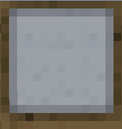
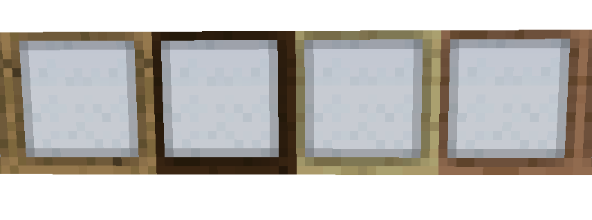

# Paper Wall (1.16.5)

     
    <recipe>paperwall</recipe>

 

Paper walls are blocks like glass, but surrounded by a wooden frame. The paper portion has a low transparency but can be seen through.

Paper walls can be crafted at the [Sawmill](../../source/buildings/sawmill).
 

## Using Paper Walls

Use paper walls in buildings to replace glass for a different look. They are also frequently used in the Asian building style.
