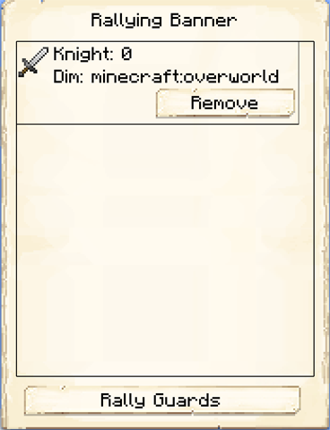

# Rallying Banner

    

    <recipe>rallyingbanner</recipe>

The rallying banner will summon your Guards to you when used. It's especially useful in raids, as Guards don't automatically know where to find the raiders.

**Note:** Your Guards will not follow you outside the colony [border](../../source/systems/border). To bring Guards outside the border, set them to Follow you on the second page of their tower GUI.

## Using the Rallying Banner

First, shift + right-click while holding the banner on a  or . This assigns the Guards in that tower to the rallying banner. (Shift + right-click on the block again to remove the tower.)

Then, shift + right-click on any other block to summon the Guards! (Shift + right-click again to dismiss them.)

At any time, you can right-click while holding the banner to open a GUI, which will show the towers currently added and the number of hired Guards at each one. You can remove the towers from this GUI, and rally/dismiss the Guards as well.

If you have the Standard reserach unlocked, you can "Place" your rallying banner down by right-clicking a Colony Banner.
 

 
