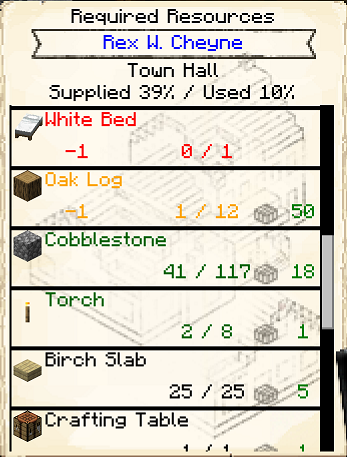

# Resource Scroll 

    

    <recipe>resourcescroll</recipe>

The resource scroll is an easy way to tell what one of your [Builders](../../source/workers/builder) needs. It's like a portable second page of the [Builder's Hut](../../source/buildings/builder)!

## Using the Resource Scroll

When you first make the resource scroll, if you right-click anywhere you will get a message to sneak + right-click on a Builder's Hut to register the resource scroll. 

 

 

Now when you right-click while holding the resource scroll, you will see all the needed materials for the Builder's Hut you clicked on. Each needed item is displayed, along with how many of that item is in the hut's inventory, and how many are needed. These amounts will change as the Builder places blocks and will show only what blocks the Builder still needs to place. The blocks in black are in their inventory. The blocks in red are the ones neither you nor the Builder has in their inventory. The blocks in green are ones you have in inventory but the Builder needs. Yellow blocks means you have some of the necessary resource, but not enough.

 

 

If you go to a [Warehouse](../../source/buildings/warehouse) and right-click the resource scroll on the Warehouse hut, the resource scroll will show you how many of each item is currently stored in that Warehouse. This will be in green to the far right of each block.