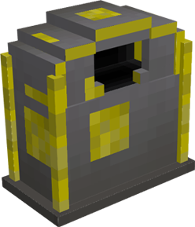

# Stash

    

    <recipe>stash</recipe>

 

The stash lets a player deposit items that they want to be picked up by a [Courier](../../source/workers/courier) to take to the [Warehouse](../../source/buildings/warehouse).

The stash can be crafted at the [Sawmill](../../source/buildings/sawmill) or by the player.
 

## Using the Stash

To use the stash, right-click on it to bring up the inventory, which works like a chest and can also accept hoppers for automation. Put items in the stash and a Courier from the nearest  will pick them up and deposit them for Workers or your own . This allows for the creation of automated farms outside of Minecolonies and cross compatibility with other mods that automate through machinery giving your workers access to the materials they need for the recipes you teach them. 
