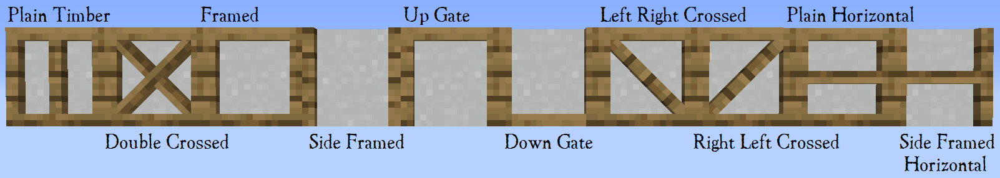

# Timber Framed Blocks (1.16.5)

[For 1.17+, click here.](../../source/dependencies/domumornamentum)

    <recipe>timberframeplain</recipe>
    <recipe>timberframealtoak</recipe> 
    <recipe>timberframealtacacia</recipe>
    <recipe>timberframealtbirch</recipe> 
    <recipe>timberframealtjungle</recipe>
    <recipe>timberframealtspruce</recipe> 
    <recipe>timberframealtdarkoak</recipe>
    <recipe>timberframealtcactus</recipe> 

 

Timber framed blocks are blocks added in Structurize. Timber framed blocks come in various wood frames, as seen in the first recipe, surrounding not only wood centers but also cactus, cobblestone, stone, paper and bricks. (The outside frames only come in wood and cactus.) 

For the rest of the variants you need to put a timber framed block into the crafting table until you get the version you want. The crafting starts with the plain version and at the end becomes the plain version again, so if you have the wrong kind of timber framed block you can easily start over again until you get the one you want. (Shown above in the recipes below the first with every kind of wooden frame.)

Timber framed blocks can be crafted at the [Sawmill](../../source/buildings/sawmill). In fact, if you teach the Sawmill the recipe for one version of a timber framed block, it'll automatically have the recipes for every other variant!

**Note:** Paper is used as a solid block in the example, but you can do the same with every other above mentioned block.

 

## Using Timber Framed Blocks

Timber framed blocks are a decoration. Simply put them where you want them, however, they are directional, meaning they change orientation depending on how you place them. 

