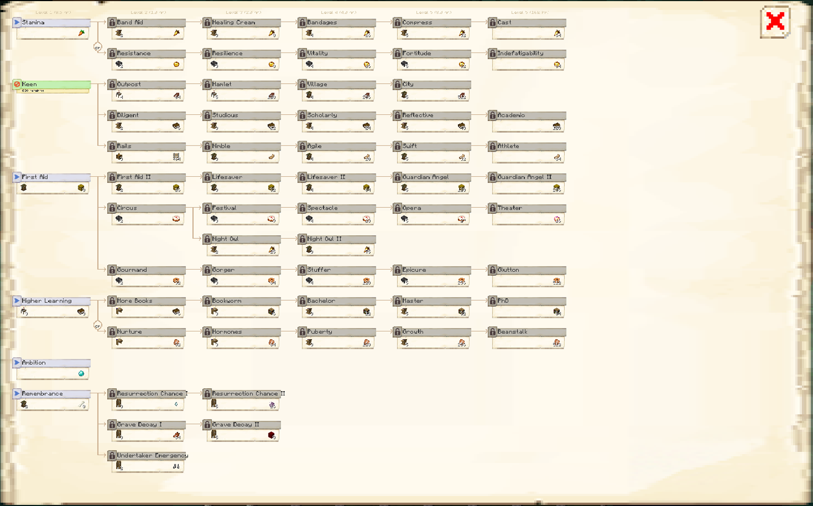
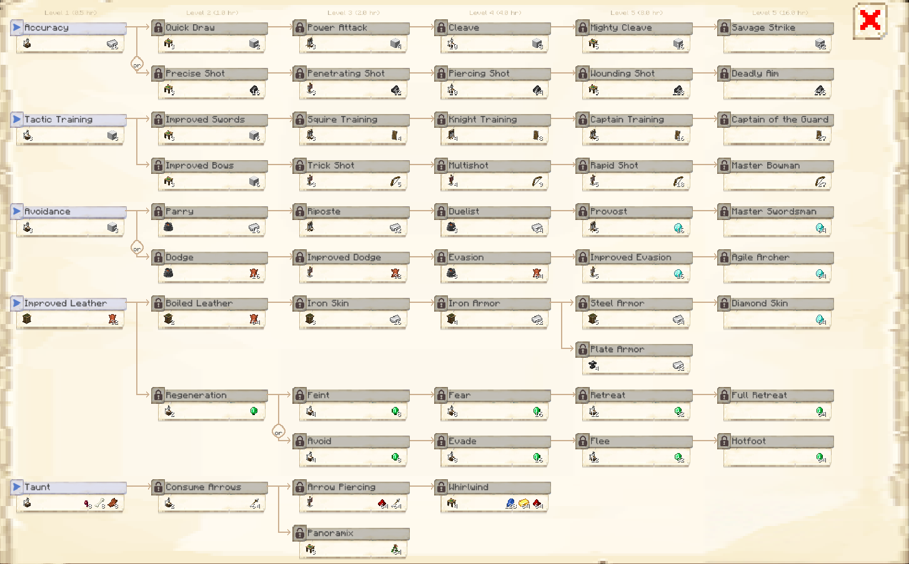
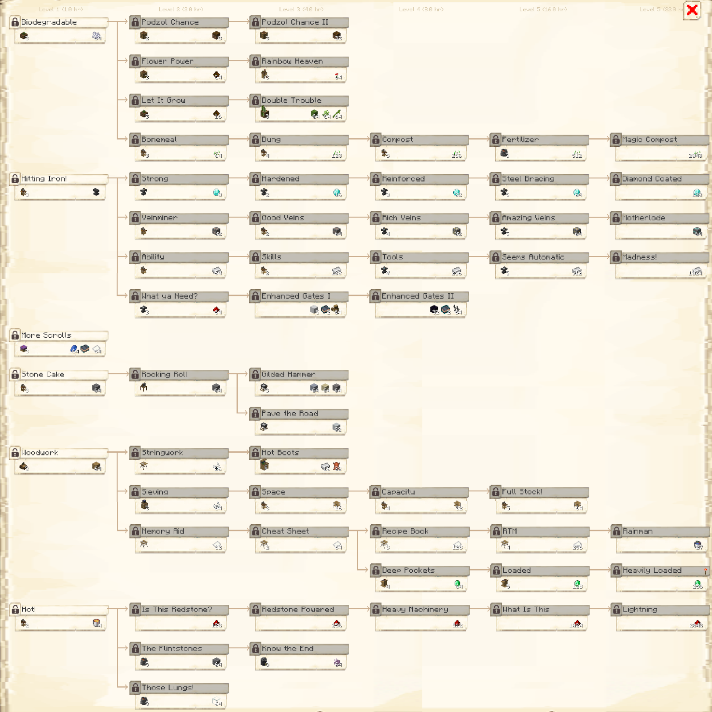

# Research System

At the [University](../../source/buildings/university), a [Researcher](../../source/workers/researcher) can research various upgrades to your colony. These are split into three trees: Combat, Civilian, and Technology. You access these from the second page of the University GUI.

Each column of a research tree is also the level the University needs to be to begin a research from that column. So:

| Research Tree Column | Minimum University Level |
| -------------------- | ------------------------ |
| 1                    | 1                        |
| 2                    | 2                        |
| 3                    | 3                        |
| 4                    | 4                        |
| 5 and higher         | 5                        |

You can only have one column 6 research in each of the Combat, Civilian, and Technology trees. To unlock a different column 6 research for that tree, you must undo the completed one first.

| Symbol | Description |
| ------ | ----------- |
|  | A research can be **blocked**, either by an unfinished prerequisite research, by a completed blocking research, or because the research tree has another column 6 research already active. |
|  | A **locked** research requires a building or buildings, or other unrelated research, before it can be started. | 
|  | An **unlocked** research has all colony and research requirements met, but requires an item or items. **These items must be in the player's inventory.** | 
|  | An **available** research is ready to begin. Clicking the title of the research will consume the items from the player's inventory and start the research. |  
|  | A **progressing** research is being worked on currently. This research will show its current progression and a rough estimate of the remaining time to completion. A progressing research can be canceled by clicking the research title and then clicking the Cancel pop-up. Cancelling a research will **not** refund the material costs. | 
|  | A **complete** research has been fully unlocked by your University. Its effects have been applied to the colony and colonists. | 
|  | Some researches are **exclusive**, requiring such extreme focus that they aren't compatible with each other. Only one research from a specific **or** selection may be learned in a colony at a time. | 
|  | Some completed researches may be **undone** if they block another research in some way, do not have a completed research that depends on them, and are not marked with a redstone torch as irreversible. Undoing a research does *not* refund the research costs and consumes the displayed item. | 

## Below is a description of each of the researches:

**Note:** Researches below are *not* cumulative unless stated otherwise.

- Branches
  - [Civilian](#civilian)
  - [Combat](#combat)
  - [Technology](#technology)
  - [Unlockables](#unlockables)

### Civilian
 

 

#### First Column

| Name | Requirements | Effects |
| ---- | ------------ | ------- |
| Stamina | 1 carrot | Unlocks the [Hospital](../../source/buildings/hospital) |
| Keen | [House](../../source/buildings/house) at least level 3; 3 books | Unlocks the [Library](../../source/buildings/library) |
| First Aid | [Town Hall](../../source/buildings/townhall) at least level 1; 8 hay bales | Increases colonists' health by 1 heart |
| Higher Learning | House at least level 3; 3 books | Unlocks the [School](../../source/buildings/school) |
| Ambition | 1 Diamond | Unlocks the [Mystical Site](../../source/buildings/mysticalsite) |
| Remembrance | [Town Hall](../../source/buildings/townhall) at least level 2; 8 bones | Unlocks the [Graveyard](../../source/buildings/graveyard) |

#### Second Column

| Name | Prerequisites | Requirements | Effects |
| ---- | ------------- | ------------ | ------- |
| Band Aid | Stamina | Library at least level 2; 1 golden carrot | Every tick that a colonist is healing, they heal by 10% more |
| Resistance | Stamina | [Restaurant](../../source/buildings/restaurant) at least level 2; 1 golden apple | Colonists can heal with only 95% saturation |
| Outpost | Keen | House at least level 4; 64 steak | Lets the colony have up to 50 colonists |
| Diligent | Keen | Library at least level 2; 6 books | Increases the rate colonists level up by 5% |
| Rails | Keen | [Courier's Hut](../../source/buildings/courier) at least level 3; 64 rails | Lets colonists use rails to get around. You don't need to provide them with minecarts, as they automagically create their own for each trip |
| Aaaioooiooo | Keen | House at least level 3; 64 vines | Citizens can climb vines |
| First Aid II | First Aid | Town Hall at least level 2; 16 hay bales | Increases colonists' health by 2 hearts |
| Circus | First Aid | Restaurant at least level 2; 1 cake | Increases colonists' happiness by 5% |
| Gourmand | First Aid | Restaurant at least level 2; 32 cookies | Food is 10% more effective at restoring colonists' saturation |
| More Books | Higher Learning | School at least level 1; 6 books | Increases the effectiveness of [Teachers](../../source/workers/teacher) by 5% |
| Nurture | Higher Learning | School at least level 1; 32 cooked chicken | Decreases the time it takes children to grow up by 5% |
| Resurrection Chance I | Remembrance | Graveyard at least level 3; 1 ghast tear | Increases [Undertakers'](../../source/workers/undertaker) chances of resurrecting citizens by 1% |
| Grave Decay I | Remembrance | Graveyard at least level 3; 64 rotten flesh | Graves take 2 more minutes before decaying |
| Undertaker Emergency | Remembrance | Graveyard at least level 2; 1 set of iron boots | Undertakers run toward graves instead of walking |

#### Third Column

| Name | Prerequisites | Requirements | Effects |
| ---- | ------------- | ------------ | ------- |
| Healing Cream | Band Aid | Library at least level 3; 8 golden carrots | Every tick that a colonist is healing, they heal by 25% more |
| Resilience | Resistance | Restaurant at least level 3; 8 golden apples | Colonists can heal with only 90% saturation |
| Hamlet | Outpost | House at least level 5; 128 steak | Lets the colony have up to 75 colonists |
| Studious | Diligent | Library at least level 3; 12 books | Increases the rate colonists level up by 10% |
| Nimble | Rails | Town Hall at least level 3; 1 rabbit foot | Increases colonists' speed by 5% |
| Lifesaver | First Aid II | Town Hall at least level 3; 32 hay bales | Increases colonists' health by 3 hearts |
| Festival | Circus | Restaurant at least level 3; 9 cakes | Increases colonists' happiness by 10% |
| Nightowl | Circus | Library at least level 2; 25 golden carrots | Colonists' bedtime is pushed back by 1 in-game hour |
| Gorger | Gourmand | Restaurant at least level 3; 64 cookies | Food is 25% more effective at restoring colonists' saturation |
| Bookworm | More Books | School at least level 3; 6 bookshelves | Increases the effectiveness of Teachers by 10% |
| Hormones | Nurture | School at least level 3; 64 cooked chicken | Decreases the time it takes children to grow up by 10% |
| Resurrection Chance II | Resurrection Chance I | Graveyard level 5; 16 chorus fruit | Increases Undertakers' chances of resurrecting citizens by 2% |
| Grave Decay II | Grave Decay I | Graveyard level 5; 8 nether wart blocks | Graves take 3 more minutes before decaying |

#### Fourth Column

| Name | Prerequisites | Requirements | Effects |
| ---- | ------------- | ------------ | ------- |
| Bandages | Healing Cream | Library at least level 4; 16 golden carrots | Every tick that a colonist is healing, they heal by 50% more |
| Vitality | Resilience | Restaurant at least level 4; 16 golden apples | Colonists can heal with only 85% saturation |
| Village | Hamlet | Town Hall at least level 4; 256 steak | Lets the colony have up to 175 colonists |
| Scholarly | Studious | Library at least level 4; 24 books | Increases the rate colonists level up by 25% |
| Agile | Nimble | Town Hall at least level 4; 10 rabbit feet | Increases colonists' speed by 10% |
| Lifesaver II | Lifesaver | Town Hall at least level 4; 64 hay bales | Increases colonists' health by 4 hearts |
| Spectacle | Festival | Restaurant at least level 4; 18 cakes | Increases colonists' happiness by 15% |
| Nightowl II | Festival | Town Hall at least level 3; 75 golden carrots | Colonists' bedtime is pushed back by 2 in-game hours (cumulative with Nightowl) |
| Stuffer | Gorger | Restaurant at least level 4; 128 cookies | Food is 50% more effective at restoring colonists' saturation |
| Bachelor | Bookworm | Library at least level 3; 12 bookshelves | Increases the effectiveness of Teachers by 25% |
| Puberty | Hormones | Library at least level 3; 128 cooked chicken | Decreases the time it takes children to grow up by 25% |
| Raising The Dead | Resurrection Chance II | Graveyard level 5; 1 Totem of Undying | Undertaker can use Totems of Undying to increase chance of resurrection |

#### Fifth Column

| Name | Prerequisites | Requirements | Effects |
| ---- | ------------- | ------------ | ------- |
| Compress | Bandages | Library level 5; 32 golden carrots | Every tick that a colonist is healing, they heal by 100% more |
| Fortitude | Vitality | Restaurant level 5; 32 golden apples | Colonists can heal with only 80% saturation |
| City | Village | Town Hall level 5; 512 steak | Lets you have over 175 colonists, up to the max in the [config file](../../source/misc/configfile) |
| Reflective | Scholarly | Library level 5; 48 books | Increases the rate colonists level up by 50% |
| Swift | Agile | Town Hall level 5; 32 rabbit feet | Increases colonists' speed by 15% |
| Guardian Angel | Lifesaver II | Town Hall level 5; 128 hay bales | Increases colonists' health by 5 hearts |
| Opera | Spectacle | Restaurant level 5; 27 cakes | Increases colonists' happiness by 20% |
| Epicure | Stuffer | Restaurant level 5; 256 cookies | Food is 100% more effective at restoring colonists' saturation |
| Master | Bachelor | Library level 5; 32 bookshelves | Increases the effectiveness of Teachers by 50% |
| Growth | Puberty | Library level 5; 256 cooked chicken | Decreases the time it takes children to grow up by 50% |

#### Sixth Column 

You can only have one sixth column research unlocked at a time!

| Name | Prerequisites | Requirements | Effects |
| ---- | ------------- | ------------ | ------- |
| Cast | Compress | 64 golden carrots | Every tick that a colonist is healing, they heal by 200% more |
| Indefatigability | Fortitude | 64 golden apples | Colonists can heal with only 50% saturation |
| Academic | Reflective | 128 books | Increases the rate colonists level up by 100% |
| Athlete | Swift | 64 rabbit feet | Increases colonists' speed by 25% |
| Guardian Angel II | Guardian Angel | 256 hay bales | Increases colonists' health by 10 hearts |
| Theater | Opera | 16 enchanted golden apples | Increases colonists' happiness by 50% |
| Glutton | Epicure | 512 cookies | Food is 200% more effective at restoring colonists' saturation |
| PhD | Master | 64 bookshelves | Increases the effectiveness of Teachers by 100% |
| Beanstalk | Growth | 512 cooked chicken | Decreases the time it takes children to grow up by 100% |

### Combat
 

 

#### First Column

| Name | Requirements | Effects |
| ---- | ------------ | ------- |
| Accuracy | [Guard Tower](../../source/buildings/guardtower) at least level 1; 16 iron ingots | Reduces the time [Guards](../../source/workers/guard) sleep by 50% |
| Tactic Training | Total of 3 Guard Tower levels; 3 blocks of iron | Unlocks the [Barracks](../../source/buildings/barracks) |
| Avoidance | Guard Tower at least level 3; 3 blocks of iron | Lets Knights use shields |
| Improved Leather | [Town Hall](../../source/buildings/townhall) at least level 1; 32 leather | Increases Guards' armor's durability by 10% |
| Taunt | Guard Tower at least level 1; 8 rotten flesh, 8 bones, 8 spider eyes | After a Guard attacks a mob, the mob targets the Guard instead of citizens or the player |

#### Second Column

| Name | Prerequisites | Requirements | Effects |
| ---- | ------------- | ------------ | ------- |
| Quick Draw | Accuracy | Barracks at least level 3; 2 blocks of iron | Increases Knights' damage by half a heart |
| Precise Shot | Accuracy | Barracks at least level 3; 16 flint | Increases Archers' damage by half a heart |
| Improved Swords | Tactic Training | Barracks at least level 3; 6 blocks of iron | Unlocks the [Combat Academy](../../source/buildings/combatacademy) |
| Improved Bows | Tactic Training | Barracks at least level 3; 6 blocks of iron | Unlocks the [Archery](../../source/buildings/archery) |
| Parry | Avoidance | [Smeltery](../../source/buildings/smeltery) at least level 1; 16 iron ingots | Increases Knights' armor by 5% |
| Dodge | Avoidance | Smeltery at least level 1; 16 leather | Increases Archers' armor by 5% |
| Boiled Leather | Improved Leather | Town Hall at least level 2; 64 leather | Increases Guards' armor's durability by 20% |
| Regeneration | Improved Leather | Guard Tower at least level 2; 1 emerald | Lets Guards run away when they have low health (this can be turned off on the 2nd page of their tower's GUI) |
| Consume Arrows | Taunt | Guard Tower at least level 2; 64 arrows | Archers will request arrows for their bows, and using them will give the Archers a damage boost of 1 heart. If they run out of arrows, they can still shoot, but without the damage boost |

#### Third Column

| Name | Prerequisites | Requirements | Effects |
| ---- | ------------- | ------------ | ------- |
| Power Attack | Quick Draw | Combat Academy at least level 3; 4 blocks of iron | Increases Knights' damage by a heart |
| Penetrating Shot | Precise Shot | Archery at least level 3; 32 flint | Increases Archers' damage by a heart |
| Squire Training | Improved Swords | Combat Academy at least level 3; 4 shields | Increases the chance for Knights to block attacks by 5% |
| Trick Shot | Improved Bows | Archery at least level 3; 5 bows | 5% chance for Archers to shoot 2 arrows at the same time |
| Riposte | Parry | Combat Academy at least level 1; 32 iron ingots | Increases Knights' armor by 10% |
| Improved Dodge | Dodge | Archery at least level 1; 32 leather | Increases Archers' armor by 10% |
| Iron Skin | Boiled Leather | Town Hall at least level 3; 16 iron ingots | Increases Guards' armor's durability by 30% |
| Feint | Regeneration | Guard Tower at least level 4; 8 emeralds | When Guards are fleeing, the damage they take is reduced by 20% |
| Avoid | Regeneration | Guard Tower at least level 4; 8 emeralds | Increases the fleeing speed of Guards by 10% |
| Arrow Piercing | Consume Arrows | Archery at least level 1; 64 arrows, 64 redstone dust | Archers' arrows can pierce through multiple enemies and cannot hit Knights or other Archers |
| Panoramix | Consume Arrows | Barracks at least level 3; 64 mistletow | Druids request water bottles and mistletoe, which increases the strength and duration of their potions |

#### Fourth Column

| Name | Prerequisites | Requirements | Effects |
| ---- | ------------- | ------------ | ------- |
| Cleave | Power Attack | Guard Towers adding up to at least level 10; 8 blocks of iron | Increases Knights' damage by one and a half hearts |
| Piercing Shot | Penetrating Shot | Guard Towers adding up to at least level 10; 64 flint | Increases Archers' damage by one and a half hearts |
| Knight Training | Squire Training | Combat Academy at least level 4; 8 shields | Increases the chance for Knights to block attacks by 10% |
| Multi Shot | Trick Shot | Archery at least level 4; 9 bows | 10% chance for Archers to shoot 2 arrows at the same time |
| Duelist | Riposte | Smeltery at least level 3; 64 iron ingots | Increases Knights' armor by 25% |
| Evasion | Improved Dodge | Smeltery at least level 3; 64 leather | Increases Archers' armor by 25% |
| Iron Armor | Iron Skin | Town Hall at least level 4; 32 iron ingots | Increases Guards' armor's durability by 40% |
| Fear | Feint | Guard Towers adding up to at least level 8; 16 emeralds | When Guards are fleeing, the damage they take is reduced by 30% |
| Evade | Avoid | Guard Towers adding up to at least level 8; 16 emeralds | Increases the fleeing speed of Guards by 20% |
| Knockback | Arrow Piercing | Barracks at least level 4; 64 redstone dust, 64 gold ingots, 128 lapis lazuli | Knights have a chance to do a special whirlwind attack, which damages and knocks back all the enemies near them |

#### Fifth Column

| Name | Prerequisites | Requirements | Effects |
| ---- | ------------- | ------------ | ------- |
| Mighty Cleave | Cleave | Barracks level 5; 16 blocks of iron | Increases Knights' damage by two hearts |
| Wounding Shot | Piercing Shot | Barracks level 5; 128 flint | Increases Archers' damage by two hearts |
| Captain Training | Knight Training | Combat Academy level 5; 16 shields | Increases the chance for Knights to block attacks by 25% |
| Rapid Shot | Multi Shot | Archery level 5; 18 bows | 25% chance for Archers to shoot 2 arrows at the same time |
| Provost | Duelist | Combat Academy level 5; 16 diamonds | Increases Knights' armor by 50% |
| Improved Evasion | Evasion | Archery level 5; 16 diamonds | Increases Archers' armor by 50% |
| Steel Armor | Iron Armor | Town Hall level 5; 64 iron ingots | Increases Guards' armor's durability by 50% |
| Plate Armor | Iron Armor | Blacksmith level 4; 32 iron ingots | Blacksmith learns [plate armor](../../source/items/platearmor) recipes |
| Retreat | Fear | Guard Towers adding up to at least level 12; 32 emeralds | When Guards are fleeing, the damage they take is reduced by 40% |
| Flee | Evade | Guard Towers adding up to at least level 12; 32 emeralds | Increases the fleeing speed of Guards by 30% |

#### Sixth Column

You can only have one sixth column research unlocked at a time!

| Name | Prerequisites | Requirements | Effects |
| ---- | ------------- | ------------ | ------- |
| Savage Strike | Mighty Cleave | 32 blocks of iron | Increases Knights' damage by 4 hearts |
| Deadly Aim | Wounding Shot | 256 flint | Increases Archers' damage by 4 hearts |
| Captain Of The Guard | Captain Training | 27 shields | Increases the chance for Knights to block attacks by 50% |
| Master Bowman | Rapid Shot | 27 bows | 50% chance for Archers to shoot 2 arrows at the same time |
| Master Swordsman | Provost | 64 diamonds | Increases Knights' armor by 100% |
| Agile Archer | Improved Evasion | 64 diamonds | Increases Archers' armor by 100% |
| Diamond Skin | Steel Armor | 64 diamonds | Increases Guards' armor's durability by 100% |
| Full Retreat | Retreat | 64 emeralds | When Guards are fleeing, the damage they take is reduced by 100% |
| Hotfoot | Flee | 64 emeralds | Increases the fleeing speed of Guards by 50% |

### Technology
 

 

#### First Column

| Name | Requirements | Effects |
| ---- | ------------ | ------- |
| Biodegradable | [Farm](../../source/buildings/farm&field) at least level 3; 64 bone meal | Unlocks the [Composter's Hut](../../source/buildings/composter) |
| Soft Shoes | 16 white wool; 16 feathers | Farmer will not trample crops |
| More Scrolls |  [Enchanter's Tower](../../source/buildings/enchantertower) at least level 3; 64 paper, 1 [ancient tome](../../source/items/ancient_tome), 64 lapis lazuli | Lets the [Enchanter](../../source/workers/enchanter) craft the [Spatial Guard Reinforcements Scroll](../../source/items/scrolls) and the [Worker-Where-Are-You Scroll](../../source/items/scrolls) |
| Stone Cake | [Mine](../../source/buildings/mine) at least level 3; 64 chiseled stone bricks | Unlocks the [Stonemason's Hut](../../source/buildings/stonemason) |
| Woodwork | [Forester's Hut](../../source/buildings/forester) at least level 3; 64 oak planks | Unlocks the [Sawmill](../../source/buildings/sawmill) |
| Hot! | Mine at least level 2; 4 lava buckets | Unlocks the [Smeltery](../../source/buildings/smeltery) |
| Hitting Iron! | Mine at least level 3; 1 anvil | Unlocks the [Blacksmith's Hut](../../source/buildings/blacksmith) |

#### Second Column

| Name | Prerequisites | Requirements | Effects |
| ---- | ------------- | ------------ | ------- |
| Podzol Chance | Biodegradable | Composter's Hut at least level 2; 8 Podzol | The [Composter](../../source/buildings/composter) has a +5% greater chance to get podzol |
| Flower Power | Biodegradable | Composter's Hut at least level 3; 64 compost | Unlocks the [Flower Shop](../../source/buildings/flowershop) |
| Let It Grow | Biodegradable | Farm at least level 3; 16 compost | Unlocks the [Plantation](../../source/buildings/plantation) |
| Bonemeal | Biodegradable | Mine at least level 3; 64 wheat seeds | Increases [Farmers'](../../source/workers/farmer) output by 10% |
| Open The Nether | More Scrolls | 3 gilded blackstone | Unlocks the [Nether Mine](../../source/buildings/nethermine) |
| Rocking Roll | Stone Cake | Stonemason's Hut at least level 1; 64 stone | Unlocks the [Crusher's Hut](../../source/buildings/crusher) |
| Stringwork | Woodwork | Sawmill at least level 1; 16 string | Unlocks the [Fletcher's Hut](../../source/buildings/fletcher) |
| Sieving | Woodwork | [Fisher's Hut](../../source/buildings/fisher) at least level 3; 64 string | Unlocks the [Sifter's Hut](../../source/buildings/sifter) |
| Memory Aid | Woodwork | Sawmill at least level 1; 32 paper | Increases the max amount of recipes stored in each hut by 25% |
| Is This Redstone? | Hot! | 128 redstone dust | Increases colonists' block breaking speed by 10% |
| The Flintstones | Hot! | Smeltery at least level 3; 64 stone bricks | Unlocks the [Stone Smeltery](../../source/buildings/stonesmeltery) |
| Those Lungs! | Hot! | Smeltery at least level 3; 64 glass | Unlocks the [Glassblower's Hut](../../source/buildings/glassblower) |
| Strong | Hitting Iron | Blacksmith's Hut at least level 1; 8 diamonds | Increases colonists' tools' durability by 5% |
| Veinminer | Hitting Iron | Mine at least level 1; 32 iron ore | [Miner](../../source/workers/miner) produces 10% more bonus ores |
| Ability | Hitting Iron | Mine at least level 1; 64 iron ingots | Increases colonists' block placing speed by 10% |
| What ya Need? | Hitting Iron | Blacksmith's Hut at least level 3; 64 redstone dust | Unlocks the [Mechanic's Hut](../../source/buildings/mechanic) |

#### Third Column

| Name | Prerequisites | Requirements | Effects |
| ---- | ------------- | ------------ | ------- |
| Podzol Chance II | Podzol Chance | Composter's Hut at least level 3; 32 Podzol | The [Composter](../../source/buildings/composter) has a +10% greater chance to get podzol |
| Rainbow Heaven | Flower Power | Flower Shop at least level 3; 64 poppies | Unlocks the [Dyer's Hut](../../source/buildings/dyer) |
| Double Trouble | Let it Grow | Plantation at least level 3; 64 bamboo, 64 sugar cane, 64 cacti | Lets the [Planter](../../source/workers/planter) plant 2 out of 3 crops at the same time |
| Dung | Bonemeal | Mine at least level 4; 128 wheat seeds | Increases Farmers' output by 25% |
| Gilded Hammer | Rocking Roll | Crusher's Hut at least level 3; 64 gravel, 64 sand, 64 clay blocks | Lets [Crushers](../../source/workers/crusher) crush based on a 1-1 ratio instead of 2-1 |
| Pave the Road | Rocking Roll | Crusher's Hut at least level 1; 32 white concrete | Unlocks the [Concrete Mixer's Hut](../../source/buildings/concretemixer) |
| Hot Boots | Stringwork | Fletcher's Hut at least level 1; 32 leather, 16 iron ingots | Gives the Miner fire resistance for those annoying lava lakes |
| Space | Sieving | Mine at least level 3; 16 [racks](../../source/items/rack) | Increases the number of items you can set as a minimum stock in the [Warehouse](../../source/buildings/warehouse), [Restaurant](../../source/buildings/restaurant), and [Bakery](../../source/buildings/bakery) GUIs by 50% |
| Cheat Sheet | Memory Aid | Sawmill at least level 3; 64 paper | Increases the max amount of recipes stored in each hut by 50% |
| Warehouse Master | Memory Aid | Sawmill at least level 3; 3 racks | Unlocks Recipe Mode setting for crafting huts |
| Builder Modes | Memory Aid | Builder Hut at least level 3; 1 diamond axe | Unlocks Build Method setting for [Builder's Hut](../../source/buildings/builder) |
| Redstone Powered | Is this Redstone? | 256 redstone dust | Increases colonists' block breaking speed by 25% |
| Know the End | The Flintstones | Bakery at least level 3; 64 chorus fruit | Lets the [Baker](../../source/workers/baker) craft chorus bread and lets the [Stonemason](../../source/workers/stonemason) craft end stone (for more information, go to the Baker and Stonemason pages) |
| Hardened | Strong | Blacksmith's Hut at least level 2; 16 diamonds | Increases colonists' tools' durability by 10% |
| Good Veins | Veinminer | Mine at least level 2; 64 iron ore | Miner produces 25% more bonus ores |
| Skills | Ability | Mine at least level 2; 128 iron ingots | Increases colonists' block placing speed by 25% |
| Enhanced Gates I | What ya Need? | 64 wooden [gates](../../source/items/gates), 2 [ancient tomes](../../source/items/ancient_tome), 5 blocks of iron | This has a bit of a complex formula, but suffice it to say it makes gates more durable |

#### Fourth Column

| Name | Prerequisites | Requirements | Effects |
| ---- | ------------- | ------------ | ------- |
| Honey Pot | Rainbow Heaven | [Apiary](../../source/buildings/apiary) at least level 3; 16 beehive | Beekeepers can harvest honeycomb and bottles at the same time |
| Compost | Dung | Mine level 5; 256 wheat seeds | Increases Farmers' output by 50% |
| Capacity | Space | Mine at least level 4; 32 racks | Increases the number of items you can set as a minimum stock in the Warehouse, Restaurant, and Bakery GUIs by 100% |
| Recipe Book | Cheat Sheet | Sawmill at least level 3; 128 paper | Increases the max amount of recipes stored in each hut by 100% |
| Deep Pockets | Cheat Sheet | Library at least level 4; 64 emeralds | Adds 9 slots to colonists' inventories |
| Heavy Machinery | Redstone Powered | 512 redstone dust | Increases colonists' block breaking speed by 50% |
| Reinforced | Hardened | Blacksmith's Hut at least level 3; 32 diamonds | Increases colonists' tools' durability by 25% |
| Rich Veins | Good Veins | Blacksmith's Hut at least level 4; 32 gold ore | Miner produces 50% more bonus ores |
| Tools | Skills | Blacksmith's Hut at least level 4; 256 iron ingots | Increases colonists' block placing speed by 50% |
| Enhanced Gates II | Enhanced Gates I | 64 iron [gates](../../source/items/gates), 2 ancient tomes, 32 obsidian | Even more durable gates! |

#### Fifth Column

| Name | Prerequisites | Requirements | Effects |
| ---- | ------------- | ------------ | ------- |
| Fertilizer | Compost | Smeltery at least level 3; 512 wheat seeds | Increases Farmers' output by 75% |
| Full Stock | Capacity | Mine level 5; 64 racks | Increases the number of items you can set as a minimum stock in the Warehouse, Restaurant, and Bakery GUIs by 200% |
| RTM (Read the Manual) | Recipe book | Sawmill at least level 4; 256 paper | Increases the max amount of recipes stored in each hut by 200% |
| Loaded | Deep Pockets | Library level 5; 128 emeralds | Adds 18 slots to colonists' inventories |
| What Is This Speed? | Heavy Machinery | 1024 redstone dust | Increases colonists' block breaking speed by 100% |
| Steel Bracing | Reinforced | Blacksmith's Hut level 5; 64 diamonds | Increases colonists' tools' durability by 50% |
| Amazing Veins | Rich Veins | Blacksmith's Hut level 5; 64 gold ore | Miner produces 100% more bonus ores |
| Seems Automatic | Tools | Blacksmith's Hut level 5; 512 iron ingots | Increases colonists' block placing speed by 100% |

#### Sixth Column

You can only have one sixth column research unlocked at a time!

| Name | Prerequisites | Requirements | Effects |
| ---- | ------------- | ------------ | ------- |
| Magic Compost | Fertilizer | 2048 wheat seeds | Increases Farmers' output by 200% |
| Rainman | RTM | 27 buckets of salmon | Workers work during rain and storms |
| Heavily Loaded | Loaded | 256 emeralds | Adds 27 slots to colonists' inventories. **This research can not be undone.** |
| Lightning | What Is This Speed? | 2048 redstone dust | Increases colonists' block breaking speed by 200% |
| Diamond Coated | Steel Bracing | 128 diamonds | Increases colonists' tools' durability by 90% |
| Motherlode | Amazing Veins | 64 diamond ore | Miner produces 200% more ores |
| Madness! | Seems Automatic | 1024 iron ingots | Increases colonists' block placing speed by 200% |

### Unlockables
 

 

Unlockables are a special research tree, consisting of researches that other colonists discover as the colony grows and progresses. This branch will only display once at least one research is available, and researches on this branch will complete instantly.

#### First Column

| Name         | Requirements             | Effects |
| ------------ | ------------------------ | ------- |
| [String Mesh](../../source/items/meshes)  | [Sifter's Hut](../../source/buildings/sifter) at least level 1 | [Fletcher](../../source/workers/fletcher) learns the String Mesh recipe |

#### Second Column

| Name         | Requirements             | Effects |
| ------------ | ------------------------ | ------- |
| [Flint Mesh](../../source/items/meshes)   | Sifter's Hut at least level 3 | [Stonemason](../../source/workers/stonemason) learns the Flint Mesh recipe |

#### Third Column

| Name         | Requirements             | Effects |
| ------------ | ------------------------ | ------- |
| [Iron Mesh](../../source/items/meshes)    | Sifter's Hut at least level 4 | [Blacksmith](../../source/workers/blacksmith) learns the Iron Mesh recipe |

#### Fourth Column

| Name         | Requirements             | Effects |
| ------------ | ------------------------ | ------- |
| [Diamond Mesh](../../source/items/meshes) | Sifter's Hut at least level 5 | [Mechanic](../../source/workers/mechanic) learns the Diamond Mesh recipe |
