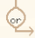
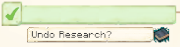

# Research System

At the ,  can research various upgrades to your colony. These are split into three trees: Combat, Civilian, and Technology. You access these from the second page of the University GUI.

Each column of a research tree is also the level the University needs to be to begin a research from that column. So:

| Research Tree Column | Minimum University Level |
| -------------------- | ------------------------ |
| 1                    | 1                        |
| 2                    | 2                        |
| 3                    | 3                        |
| 4                    | 4                        |
| 5+                   | 5                        |

You can only have one column 6 research in each of the Combat, Civilian, and Technology trees. To unlock a different column 6 research for that tree, you must undo the completed one first.

| Symbol                                                                                          | Description                                                                                                                                                                                                                                                                                                                                 |
| ----------------------------------------------------------------------------------------------- | ------------------------------------------------------------------------------------------------------------------------------------------------------------------------------------------------------------------------------------------------------------------------------------------------------------------------------------------- |
|       | A research can be **blocked**, either by an unfinished prerequisite research, by a completed blocking research, or because the research tree has another column 6 research already active.                                                                                                                                                  |
|         | A **locked** research requires a building or buildings, or other unrelated research, before it can be started.                                                                                                                                                                                                                              |
|     | An **unlocked** research has all colony and research requirements met, but requires an item or items. **These items must be in the player's inventory.**                                                                                                                                                                                    |
|       | An **available** research is ready to begin. Clicking the title of the research will consume the items from the player's inventory and start the research.                                                                                                                                                                                  |
|  | A **progressing** research is being worked on currently. This research will show its current progression and a rough estimate of the remaining time to completion. A progressing research can be canceled by clicking the research title and then clicking the Cancel pop-up. Cancelling a research will **not** refund the material costs. |
|     | A **complete** research has been fully unlocked by your University. Its effects have been applied to the colony and colonists.                                                                                                                                                                                                              |
|          | Some researches are **exclusive**, requiring such extreme focus that they aren't compatible with each other. Only one research from a specific **or** selection may be learned in a colony at a time.                                                                                                                                       |
|             | Some completed researches may be **undone** if they block another research in some way, do not have a completed research that depends on them, and are not marked with a redstone torch as irreversible. Undoing a research does *not* refund the research costs and consumes the displayed item.                                           |

## Below is a description of each of the researches:

**Note:** Researches below are *not* cumulative unless stated otherwise.


- [{{ research_tree[1].name }}]({{ "#" | append: research_tree[1].name | downcase }})




### {{ research_tree[1].name }}
[Back to top](#top-anchor)


{{ research_tree[1].description }}






