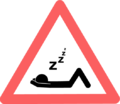

# Worker System

<b> If it is raining, snowing, nighttime, or a citizen died yesterday (in-game time), your citizens will stop working!</b>

## Traits
When hiring a worker at a hut, the primary trait used in that work will be highlighted in **green** and the secondary trait in **yellow** to help you decide which citizen is the best worker for the job. The higher a worker's skill, the faster and more efficient they will be. Each trait also has a specific bonus for the job. To see these bonuses, please visit the worker pages.

Workers' skills increase as they work. They are limited by the level of the worker's home. The level of a worker's work hut and their Intelligence skill level affect the speed that they level up.

| Home Level | Max Skill Level |
| ---------- | --------------- |
| 0          | 0               |
| 1          | 9               |
| 2          | 19              |
| 3          | 29              |
| 4          | 39              |
| 5          | 99              |

 

A chart of all the jobs, their skills, and their skills's effects, from hog#1112 (skills) and Estyria#2729 (effects) on [Discord](https://discord.minecolonies.com):
 
 



## Tool/Sword Levels

The type of tools/swords workers can use depends on the level of a worker's work hut.
Note that each enchantment level counts as 1 enchantment.
For example, Unbreaking II counts as 2 enchantments, Efficiency V counts as 5 enchantments, and a tool with both Unbreaking II and Efficiency I counts as having 3 enchantments.

| Work Hut Level | Max Tool/Sword Level                                                                                                                     |
| -------------- | ---------------------------------------------------------------------------------------------------------------------------------------- |
| 0              | Wood or Gold + 0 enchantments                                                                                                            |
| 1              | Stone + 0 enchantments (OR Wood/Gold + 1 enchantment)                                                                                    |
| 2              | Iron + 0 enchantments (OR Wood/Gold + 2 enchantments OR Stone + 1 enchantment)                                                           |
| 3              | Diamond + 0 enchantments (OR Wood/Gold + 3 enchantments OR Stone + 2 enchantments OR Iron + 1 enchantment)                               |
| 4              | Netherite + 0 enchantments (OR Wood/Gold + 4 enchantments OR Stone + 3 enchantments OR Iron + 2 enchantments OR Diamond + 1 enchantment) |
| 5              | All Tools + unlimited enchantments                                                                                                       |

## Bow/Fishing Rod Levels

There is also a system in place for the type of bows and fishing rods workers can use. This also depends on the level of a worker's work hut.

| Work Hut Level | Enchantments           |
| -------------- | ---------------------- |
| 0              | 0 enchantments         |
| 1              | 0 enchantments         |
| 2              | 1 enchantments         |
| 3              | 2 enchantments         |
| 4              | 3 enchantments         |
| 5              | Unlimited enchantments |

Modded fishing rods with higher durability may require a higher Work Hut level.

## Guard Armor Levels

There is also a system in place for the type of armor Guards can use. This depends on the level of their Tower.

| Tower Level | Max Armor Damage Reduction                                                                                             |
| ----------- | ---------------------------------------------------------------------------------------------------------------------- |
| 1           | Leather or Gold                                                                                                        |
| 2           | Chain + 0 enchantments (OR Leather/Gold + 1 enchantment)                                                               |
| 3           | Iron + 0 enchantments (OR Leather/Gold + 2 enchantments OR Chain + 1 enchantment)                                      |
| 4           | Diamond or Plate + 0 enchantments (OR Leather/Gold + 3 enchantments OR Chain + 2 enchantments OR Iron + 1 enchantment) |
| 5           | All Armor + unlimited enchantments (including [Plate](../../source/items/platearmor))                                  |

Guards can use most modded armor within these rules, though they may not be able to use or benefit from special traits of that armor.
