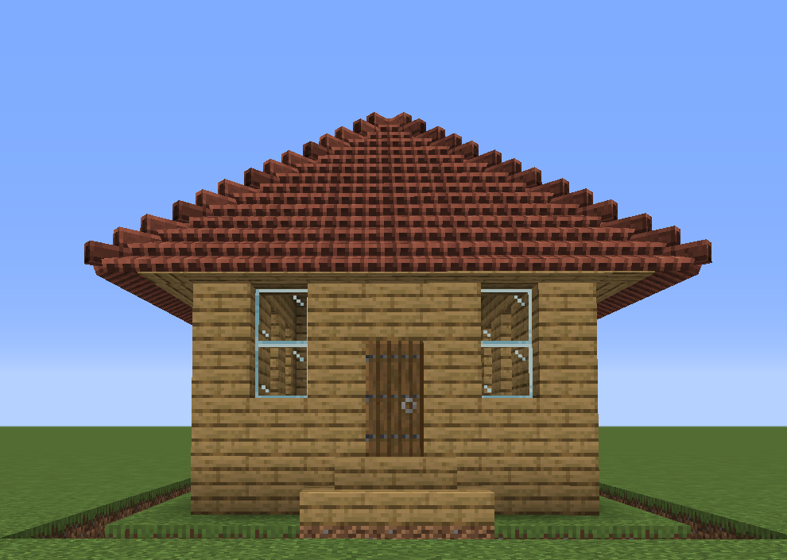
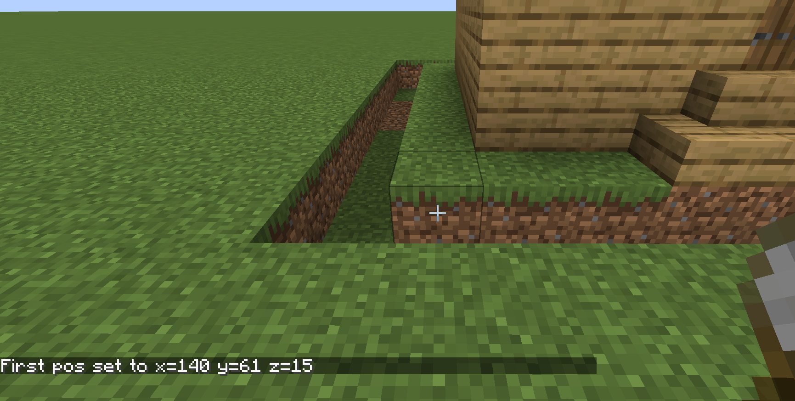
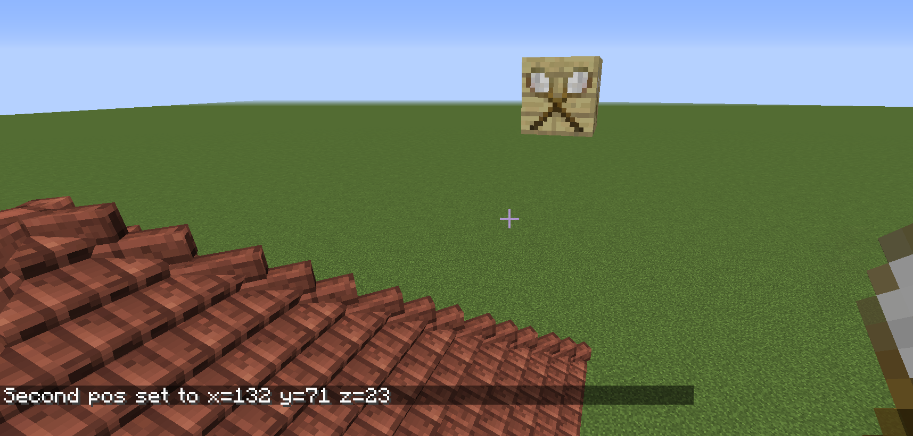
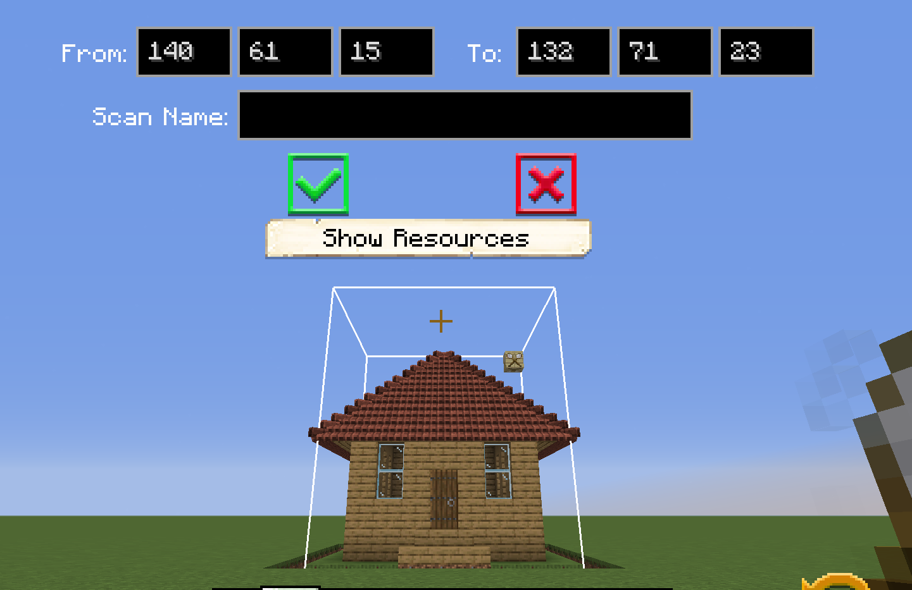
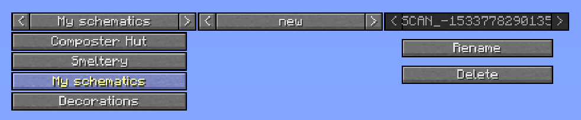
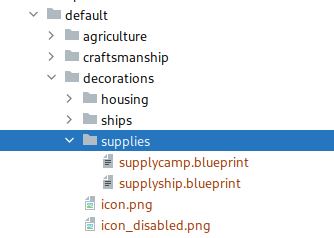
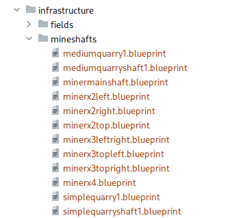

# Schematics

Schematics are files containing block and entity information of a certain area a player scanned with the [Scan Tool](../items/scantool) in-game. You can use the scan tool and scan ANY building or structure you like in singleplayer or multiplayer and then have your [Builder](../../source/workers/builder) build it for you (provided that you give them all the materials needed, of course).

### Note: In 1.19, the build tool and the schematic infrastructure changed. This means that parts of the information below may only apply to one of both versions. Those parts are annotated with [1.18] and [1.19]. Anything not annotated holds for both versions

- [Schematics](#schematics)
  - [Scanning a New Structure](#scanning-a-new-structure)
  - [Placing a Schematic.](#placing-a-schematic)
  - [Style packs](#style-packs) [1.19]
  - [FAQ](#faq)
      - [How do I install custom schematics I just downloaded?](#how-do-i-install-custom-schematics-i-just-downloaded)
      - [What and Where is the scans folder?](#what-and-where-is-the-scans-folder)
      - [Where is the schematic folder?](#where-is-the-schematic-folder)
      - [I have a "*/minecolonies/01e6a291-8a01-4763-bcae-f3a8797b1d52/cache/" folder, what is that for?](#i-have-a-%22minecolonies01e6a291-8a01-4763-bcae-f3a8797b1d52cache%22-folder-what-is-that-for)
      - [How to create custom huts?](#how-to-create-custom-huts)
      - [How to override some built-in schematics?](#how-to-override-some-built-in-schematics)
      - [How to use custom huts?](#how-to-use-custom-huts)
      - [How to allow my players to use their own huts' schematics on my server?](#how-to-allow-my-players-to-use-their-own-huts-schematics-on-my-server)
      - [How to allow my players to use their scanned schematics on my server?](#how-to-allow-my-players-to-use-their-scanned-schematics-on-my-server)
      - [How to disable built-in schematics completely?](#how-to-disable-built-in-schematics-completely)

## Scanning a New Structure

Once you have a structure or area you want to scan to have your Builder build, you need to determine the exact area that needs to be scanned. 

Take your [Scan Tool](../items/scantool) and left-click the lowest left block of the area and then place a block (it can be a [placeholder block](../../source/items/placeholderblocks) in the top right corner and right-click on it.

Then click in the air to see the entire structure.

Once you have the full area set, you can press Escape and the white outline of the scan area will stay in place. Go around it to double-check that everything you want is in the scan area. If the area contains multiple eligible anchor blocks (hut blocks, tag anchors or decoration controllers), you need to shift+left click the correct anchor block (e.g. the barracks hut block in a barracks schematic). When you are ready, you can right-click in the air again to get the GUI to display where you can enter your scan name. Then press the green checkmark to save the scan.

Scans are saved in `../minecolonies/scan/new/...` [1.18] or `*/blueprints/<yourplayername>/scans` [1.19]

[1.18] Once the scans are saved, they need to be moved to the `../structurize/schematics/(folder)/file` if they are a <a href="#customhuts">custom hut</a>.
[1.19] Once the scans are saved, they need to be placed in a style pack, preferably in the correct folder. See the [style packs](#style-packs) chapter for more details.

## Placing a Schematic.

[1.18] Once you have scanned a structure, you can use the [build tool](../../source/items/buildtool) to have your [Builder](../../source/workers/builder) build it for you. Once you right-click with the build tool, you will have to select "My Schematics" (in the left dropdown menu) and on the right dropdown menu you will see the scans that you have made. There is also a Rename button where you can change the name of the scan. You can also delete any of your saved scans.

[1.19] The scanned structure can be found in the [build tool](../../source/items/buildtool) under the style pack with your own name. Click "Switch Pack" -> "&lt;yourplayername&gt;" (icon looks like the scan tool) -> "scans". 

## Style packs
([1.19] only)

Styles are now structured in so-called style packs. This is similar to a resource pack or data pack, in that it has a file with some metadata about the style (the name, a description, optionally a link to an image, etc.), and a folder structure with the actual files.

Stylepacks live in the blueprints folder, within your Minecraft folder. This folder already contains one style pack: One with your player's name. This style pack will contain your scanned files, and can be used to test schematics. In order to make a new style, you need to make a new schematic pack.

### The pack.json
This json file contains metadata describing the style:
| Key Name                               | Type             | Description |
| -------------------------------------- | ---------------- | ----------- |
| <code>"version"</code>                 | number           | Pack version, 1 at the moment |
| <code>"pack-format"</code>             | number           | Descriptor for the pack format, needs to be 1 at the moment |
| <code>"desc"</code>                    | string           | Description of the style. This will be visible in the build tool to explain what your style is about |
| <code>"authors"</code>                 | array of strings | Names of the authors, in order to credit them. This is visible in the build tool |
| <code>"mods"</code>                    | array of strings | Names of used mods (ids). The style is not visible if one of those mods is not installed, to prevent broken schematics |
| <code>"name"</code>                    | string           | The name of the style pack |
| <code>"icon"</code>                    | string           | The name of the file with an icon which is showed in the style packs selection screen |

### The folder structure

There are several folders, separating the buildings and decorations in categories.
Each of the folders at the highest level can have a couple of icons, named `icon.png` and `icon_disabled.png`. Those are shown in the button bar right above the hot bar.

You can download a template folder structure from [github](https://github.com/ldtteam/minecolonies/tree/version/1.19/src/main/resources/blueprints/minecolonies) (template.zip), which contains the icons used for the official styles already.
That github page also contains examples how different styles are structured.
An overview with which buildings go into which folders can also be found [here](https://airtable.com/shruNNUKhTNk0saz5).

Decorations are less strict. You can make categories for them as you see fit. E.g. if you have two styles of roads, one for early game and one for later game, you could put them in infrastructure/roads/simple/ and infrastructure/roads/nice/.

**Note:** Each folder can only contain folders or files. If there are folders there, files won't be visible in the build tool!

## FAQ

This is a FAQ section to answer common questions regarding schematics in MineColonies.

#### How do I install custom schematics I just downloaded?

[1.18] Those custom schematics go in `*/structurize/schematics`. Unzip the zip you downloaded, and put all subfolders in the schematics folder. That folder should contain folders like &lt;stylename&gt;, decorations, walls, supplycamps etc. (depending on which style you installed)
[1.19] The style pack goes in the "blueprints" folder. Unzip the zip, and find the folder containing the pack.json (either the unzipped folder, or a folder directly in it, depending on how the zip was made). This folder needs to be placed in `*/blueprints`

#### What and where is the scans folder?

The scans folder is where the schematics are saved after performing a scan using the scan tool in MineColonies.
[1.18] This is a client-side-only directory which is located in Minecraft's folder under: `*/structurize/scans/`. Freshly scanned schematics can be found in `*/structurize/scans/new/` unless they have been renamed in-game. (If they aren't there, look in `*/minecolonies/scans/new`.) This directory is shared between all your singleplayer games and multiplayer games.
[1.19] This is located in your own style pack in Minecraft's folder under: `*/blueprints/<yourplayername>/scans/`. This folder is shared between all your singleylayer and multiplayer games.

#### Where is the schematic folder?

[1.18] Custom schematics need to be copied inside the schematic folder. For both singleplayer and multiplayer games, the folder is under `*/structurize/schematics/`.
[1.19] Custom schematics need to be placed in a (custom) [style pack](#style-packs). For more information about that, look there.

#### I have a "*/minecolonies/01e6a291-8a01-4763-bcae-f3a8797b1d52/cache/" folder, what is that for?

[1.18] When playing on a server, the server needs to send the schematics to the players so that the build tool's preview works. Those schematics are saved in Minecraft's directory under `*/structurize/{ServerUUID}/cache/`, where ServerUUID is the unique identifier of the server. Those directories can be safely removed as they are automatically created by the server when needed.

#### How to create <a id="customhuts">custom huts</a>?

To create new schematics, there are some guidelines that you must follow: the scans MUST have the same footprint for each level of the hut; the scans must contain the hut's block, for example the Builder's Hut block for the [Builder's Hut](../../source/buildings/builder); the hut block need to be exactly at the same place and have the same rotation for each level

[1.18]
The scans' filenames need to follow the naming convention: {StyleName}/{HutName}{HutLevel}.blueprint. For example, for the Builder's Huts with the MyOwn style, we would have:

*myown/builder1.blueprint*
*myown/builder2.blueprint*
*myown/builder3.blueprint*
*myown/builder4.blueprint*
*myown/builder5.blueprint*

- **Note:** In the [build tool](../../source/items/buildtool), the extension is hidden. HutName can be any of the listed huts below. The maximum level is 5 (except for the Tavern; its max level is 3).

Alternative designs can be placed under as style name like "myownalternative".

<!-- For the new build tool; uncomment this when it's ready
If you have alternative designs for the same hut, the alternative huts can go in the same folder as the regular hut. 
The name is somewhat arbitrary; i.e., both "citizenalt1.blueprint" and "altcitizen1.blueprint" are valid.

If you have alternative huts, though, please prepare the following for each: "oldaltstylename", "folderwherealtis/altfilename"
Note that supply ships and camps go into "decorations/supplies" and miner schematics into "infrastructure/mineshafts"

-->

Once ready, move the `myown` folder into the schematics folder and start your game. You should be able to see it with the the build tool.

**Note:** Remember that you need the appropriate hut in your inventory to be able to see the schematics in the build tool.

[1.19]
The naming for the buildings is not strict anymore. The only thing that is important is that they are named consistently, and that their names end with the hut level.
Alternate designs can just have a different name than the primary one. E.g. if you named the level 1 builder's hut "builder1", an alternative version could be called "altbuilder1" or "builderalt1" or even something completely different ("constructionworker1").

Once ready, you need to make a [style pack](#style-packs) out of them.
The schematics are visible in the build tool without the hut block, but you can't view them in survival mode (their button is greyed out, with an error message that you need to have the hut block)

## [1.18] Custom Hut Filenames

Here is a full list, up-to-date as of 20 January 2021, of the building names. Please note that *capitalization matters*.

| Level 1        | Level 2        | Level 3        | Level 4        | Level 5        |
| :------------- | :------------- | :------------- | :------------- | :------------- |
| archery1       | archery2       | archery3       | archery4       | archery5       |
| alchemist1     | alchemist2     | alchemist3     | alchemist4     | alchemist5     |
| baker1         | baker2         | baker3         | baker4         | baker5         |
| barracks1      | barracks2      | barracks3      | barracks4      | barracks5      |
| barrackstower1 | barrackstower2 | barrackstower3 | barrackstower4 | barrackstower5 |
| beekeeper1     | beekeeper2     | beekeeper3     | beekeeper4     | beekeeper5     |
| blacksmith1    | blacksmith2    | blacksmith3    | blacksmith4    | blacksmith5    |
| builder1       | builder2       | builder3       | builder4       | builder5       |
| chickenherder1 | chickenherder2 | chickenherder3 | chickenherder4 | chickenherder5 |
| citizen1       | citizen2       | citizen3       | citizen4       | citizen5       |
| combatacademy1 | combatacademy2 | combatacademy3 | combatacademy4 | combatacademy5 |
| composter1     | composter2     | composter3     | composter4     | composter5     |
| concretemixer1 | concretemixer2 | concretemixer3 | concretemixer4 | concretemixer5 |
| cook1          | cook2          | cook3          | cook4          | cook5          |
| cowboy1        | cowboy2        | cowboy3        | cowboy4        | cowboy5        |
| crusher1       | crusher2       | crusher3       | crusher4       | crusher5       |
| deliveryman1   | deliveryman2   | deliveryman3   | deliveryman4   | deliveryman5   |
| dyer1          | dyer2          | dyer3          | dyer4          | dyer5          |
| enchanter1     | enchanter2     | enchanter3     | enchanter4     | enchanter5     |
| farmer1        | farmer2        | farmer3        | farmer4        | farmer5        |
| fisherman1     | fisherman2     | fisherman3     | fisherman4     | fisherman5     |
| fletcher1      | fletcher2      | fletcher3      | fletcher4      | fletcher5      |
| florist1       | florist2       | florist3       | florist4       | florist5       |
| glassblower1   | glassblower2   | glassblower3   | glassblower4   | glassblower5   |
| graveyard1     | graveyard2     | graveyard3     | graveyard4     | graveyard5     |
| guardtower1    | guardtower2    | guardtower3    | guardtower4    | guardtower5    |
| hospital1      | hospital2      | hospital3      | hospital4      | hospital5      |
| library1       | library2       | library3       | library4       | library5       |
| lumberjack1    | lumberjack2    | lumberjack3    | lumberjack4    | lumberjack5    |
| mechanic1      | mechanic2      | mechanic3      | mechanic4      | mechanic5      |
| miner1         | miner2         | miner3         | miner4         | miner5         |
| mysticalsite1  | mysticalsite2  | mysticalsite3  | mysticalsite4  | mysticalsite5  |
| netherworker1  | netherworker2  | netherworker3  | netherworker4  | netherworker5  |
| plantation1    | plantation2    | plantation3    | plantation4    | plantation5    |
| rabbithutch1   | rabbithutch2   | rabbithutch3   | rabbithutch4   | rabbithutch5   |
| sawmill1       | sawmill2       | sawmill3       | sawmill4       | sawmill5       |
| school1        | school2        | school3        | school4        | school5        |
| shepherd1      | shepherd2      | shepherd3      | shepherd4      | shepherd5      |
| sifter1        | sifter2        | sifter3        | sifter4        | sifter5        |
| smeltery1      | smeltery2      | smeltery3      | smeltery4      | smeltery5      |
| stonemason1    | stonemason2    | stonemason3    | stonemason4    | stonemason5    |
| stonesmeltery1 | stonesmeltery2 | stonesmeltery3 | stonesmeltery4 | stonesmeltery5 |
| swineherder1   | swineherder2   | swineherder3   | swineherder4   | swineherder5   |
| tavern1        | tavern2        | tavern3        | N/A            | N/A            |
| townhall1      | townhall2      | townhall3      | townhall4      | townhall5      |
| university1    | university2    | university3    | university4    | university5    |
| warehouse1     | warehouse2     | warehouse3     | warehouse4     | warehouse5     |

## Custom Supply Ships and Camps

The process for custom [supply ships and camps](../../source/items/supplycampandship) is slightly different: 

| Version | Camp or Ship | File Name and Path |
| :-----: | :----------: | :----------------: |
| [1.18]  | Camp | structurize/schematics/supplycamp/myownsupplycamp |
| [1.18]  | Ship | structurize/schematics/supplyship/myownsupplyship |
| [1.19]  | Camp | blueprints/&lt;myownstyle&gt;/decorations/supplies/supplycamp |
| [1.19]  | Ship | blueprints/&lt;myownstyle&gt;/decorations/supplies/supplyship |

[1.18] So, for example, the path would be `structurize/schematics/wildwest/builder1` for the Builder's Hut level 1 and `structurize/schematics/supplycamp/wildwestsupplycamp` for the supply camp.
[1.19] So, for example, the path would be `blueprints/wildwest/fundamentals/builder1` for the Builder's Hut level 1 and `blueprints/wildwest/decoration/supplies/supplycamp` for the supply camp.

## Hut Requirements

| Building                                                | Requirements                                                         | Suggested           | 
| :-----------------------------------------------------: | :------------------------------------------------------------------: | :-----------------: | 
| [Archery](../../source/buildings/archery)               | 1 archery dummy (a hay bale with a button on it); 1 bed per level | at least 1 standing position per level (a glowstone block, or any block tagged with `work`) | 
| [Alchemist](../../source/buildings/alchemist)           | 1 brewing stand per level; 2 soul sand per level starting at level 2 (with 4 soul sand); leaves next to logs, i.e. "trees" |                     |
| [Bakery](../../source/buildings/bakery)                 | 1 furnace                                                            |                     | 
| [Barracks](../../source/buildings/barracks)             | 1 Barracks Tower per level (up to level 4)                           |                     |
| [Barracks Tower](../../source/buildings/barrackstower)  |                                                                      | 1 bed per level     |
| [Builder's Hut](../../source/buildings/builder)         |                                                                      | 1 rack per level    |
| [Combat Academy](../../source/buildings/combatacademy)  | 1 combat dummy per level (a pumpkin on top of a bale of hay); 1 bed per level        |                     |
| [Composter's Hut](../../source/buildings/composter)     | 1 [compost barrel](../../source/items/compostbarrel) per level       |                     |
| [Concrete Mixer's Hut](../../source/buildings/concretemixer) | 3 blocks of flowing water with solid blocks below and air blocks above      |                     |
| [Dyer's Hut](../../source/buildings/dyer)               | 1 furnace                                                            |                     |
| [Fisher's Hut](../../source/buildings/fisher)           | Hut block placed on a block at water level                           | At least 7x7x1 unobstructed body of water if integrating fishing location in the schematic |
| [Flower Shop](../../source/buildings/flowershop)        | 4 [compost blocks](../../source/items/compost) per level             |                     |
| [Glassblower's Hut](../../source/buildings/glassblower) | 1 furnace per level                                                  |                     |
| [Graveyard](../../source/buildings/graveyard)           | Named Graves, with the amount increasing per level | 14 named graves at level 1, 18 named graves at level 2, 27 named graves at level 3, 36 named graves at level 4, 50 named graves at level 5 |
| [Guard Tower](../../source/buildings/guardtower)        |                                                                      | 1 bed for aesthetics|
| [Hospital](../../source/buildings/hospital)             | 1 bed per level                                                      |                     |
| [House](../../source/buildings/house)                   | 1 bed per level                                                      |                     |
| [Library](../../source/buildings/library)               | Bookshelves                                                          |                     |
| [Mine](../../source/buildings/mine)                     | A few starting ladders where the shaft's ladders will go             |                     |
| [Nether Mine](../../source/buildings/nethermine)        | A nether portal, and an enclosed 1x1x2 room                          |                     |
| [Plantation](../../source/buildings/plantation)         | 12 per level, 4 for each of sugar cane, cactus and bamboo            |                     |
| [Restaurant](../../source/buildings/restaurant)         | 1 furnace per level                                                  |                     |
| [School](../../source/buildings/school)                 | 2 carpets per level                                                  | 4 carpets per level |
| [Smeltery](../../source/buildings/school)               | 1 furnace per level                                                  |                     |
| [Stone Smeltery](../../source/buildings/stonesmeltery)  | 1 furnace per level                                                  |                     |
| [Tavern](../../source/buildings/tavern)                 | 4 beds and a dining room                                             | [Horizontal barrels](../../source/items/barrel_horizontal) and/or [vertical barrels](../../source/items/barrel_vertical) |
| [University](../../source/buildings/university)         | Bookshelves                                                          |                     |
| [Warehouse](../../source/buildings/warehouse)           | [Racks](../../source/items/rack) (more each level)                   |                     |

Some buildings may also require tags to be set on certain blocks using the [tag tool](../../source/items/tagtool).

## Level Requirements for Overworld Styles

| Level          | Requirements          |
| :------------: | :-------------------: |
| Level 1        | Very Easy - Wooden    | 
| Level 2        | Easy - Iron           | 
| Level 3        | Medium - Nether       | 
| Level 4        | Difficult - Ocean     |
| Level 5        | Very Difficult - End  |

## Level Requirements for Nether Styles

| Level          | Requirements          |
| :------------: | :-------------------: |
| Level 1        | Very Easy - Nether    | 
| Level 2        | Easy - Rarer Nether   | 
| Level 3        | Medium - Overworld    | 
| Level 4        | Difficult - Ocean     |
| Level 5        | Very Difficult - End  |

 
 

## Tips on Building

### Do
<ul>
  <li>Make all levels of a hut have the same footprint for x, y, and z</li>
  <li>Place the hut block in the same location with the same rotation</li>
  <li>Make sure all <a href="../../source/items/rack">racks</a> and furnaces are in the same location through all levels (to prevent the contents spilling out when they're getting moved)</li>
  <li>Use <a href="../../source/items/placeholderblocks">placeholders</a> where you want to keep any existing block (including from level to level), like the <a href="../../source/buildings/barrackstower">Barracks Towers</a> in the <a href="../../source/buildings/barracks">Barracks</a> schematic</li>
  <li>Use <a href="../../source/items/placeholderblocks">solid placeholders</a> at or below ground level</li>
  <li>Place a <a href="../../source/items/tagtool"><code>groundlevel</code> tag</a> at ground level if your hut isn't sitting directly on the ground.</li>
  <li>Use only vanilla blocks or Structurize blocks (for official styles)</li>
  <li>Use Books and Quills instead of blank books, or written books on a lectern. (Keep a copy of the original book and quill somewhere, if it turns out you made a mistake!)</li>
</ul>

### Don't 
<ul>
  <li>Use unobtainable items in builds (no command blocks, petrified wood, infested blocks, or mob heads (including player heads))</li>
  <li>Change someone else's style (officially) unless specifically asked to do so</li>
</ul>

## Additional Information

### How to override some built-in schematics?

[1.18] Simply create a schematic file with the same style/name. For instance, to override the [Builder's Hut](../../source/buildings/builder) wooden level 1, create a schematic file name called wooden/builder1.blueprint.
[1.19] Unfortunately, this is not possible, unless you override the entire style (make a style pack with the same name as an existing style pack, in that case).

### How to use custom huts?

The custom huts need to be copied in the schematics folder [1.18] or in a style pack [1.19]. Once copied, you can start your singleplayer or multiplayer game as usual. You should see them in the [build tool](../../source/items/buildtool) (if you have the hut block in your inventory).

### How to allow my players to use their own huts' schematics on my server?

You will have to copy them yourself in the schematics folder on the server and restart it.

### How to allow my players to use their scanned decoration schematics on my server?

Edit the Structurize configuration file at `minecraft/config/structurize-common.toml` and set allowPlayerSchematics to true. This allows the player to use their own decorations. It is not possible for the player to use their own huts' schematics. You can also limit the number of players' schematics at any given time by editing maxCachedSchematics (default is 100). When the limit is reached, the server will start deleting unused schematics.

### How to disable built-in schematics completely?

Edit the Structurize configuration file at `minecraft/config/structurize-common.toml` and set ignoreSchematicsFromJar to true. Be aware: things will break if some huts' schematics are missing.

### How to create upgradable decoration schematics?

[1.18] Add the [deco controller](../../source/items/decocontroller) somewhere in the schematic with the name of the schematic, where you'll put it in the file directory, and its level. Make sure to actually put the decoration in that file path, but only after scanning - don't include the path in the scan name.
[1.19] Put the [deco controller](../../source/items/decocontroller) somewhere in the schematic, and make sure the name of the schematic ends with a number while scanning. The decoration controller will automatically find the decoration in the same folder with the next number.

