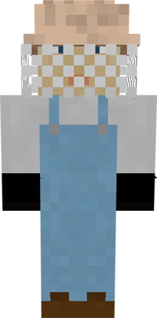
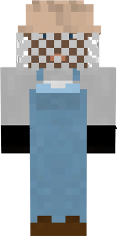

# Beekeeper

&nbsp;&nbsp;&nbsp;

  

    

      
<strong>Primary Trait:</strong>

      
<strong>Secondary Trait:</strong>

      
<strong>Building:</strong>

    

    

      
Dexterity

      
Adaptabilty

      
<a href="../buildings/apiary">Apiary</a>

    

  

The Beekeeper will breed bees and harvest honeycombs or honey bottles (you can choose which on the second page of the Apiary's GUI). They will request flowers to breed the bees with.

Beekeepers don't require campfires beneath their hives. Instead, their Dexterity level determines their chance to get stung. Their Adaptability level affects the amount of waiting time between checking each hive.

The level of the Apiary determines the max number of hives they can take care of:

| Apiary Level | Max Number of Hives |
| ------------ | ------------------- |
| 1 | 1 |
| 2 | 2 |
| 3 | 4 |
| 4 | 8 |
| 5 | 16 |

**Note:** If the Beekeeper is asking for hives but there are some nearby, make sure you've set the hives for them to take care of with the hive tool. This tool is accessed from the second page of the Apiary GUI.
