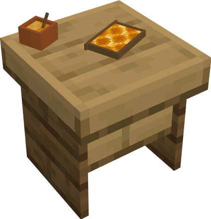
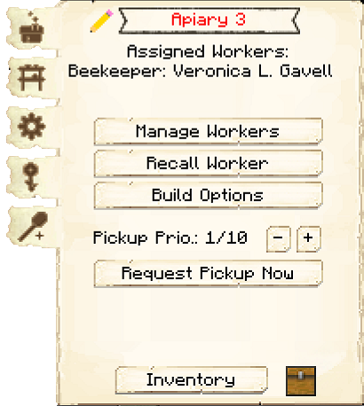
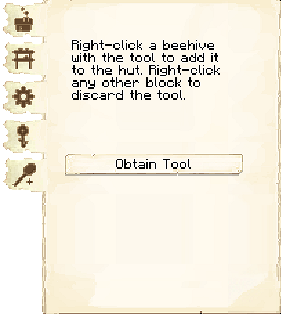

# Apiary

    
    

    

        

        
<strong>Worker:</strong>

        

        

        
<a href="../workers/beekeeper">Beekeeper</a>

        

    

    

    <recipe>apiary</recipe>

The Apiary is where the Beekeeper works. The Beekeeper breeds bees and harvests honeycombs or honey bottles (you can choose which on the second page of the Apiary's GUI).

The level of the Apiary determines the max number of hives the Beekeeper can take care of:

| Apiary Level | Max Number of Hives |
| ------------ | ------------------- |
| 1 | 1 |
| 2 | 2 |
| 3 | 4 |
| 4 | 8 |
| 5 | 16 |

**Note:** If the Beekeeper is asking for hives but there are some nearby, make sure you've set the hives for them to take care of with the hive tool. This tool is accessed from the second page of the Apiary GUI (see below).

## Apiary GUI

 

When accessing the Apiary Hut block by right-clicking on it, you will see a GUI with different options. You start on the main tab:

 

  

    
  

  

     
    <ul>
      
        <li><strong>{{ item.button }}:</strong> {{ item.content }}</li>
      
    </ul>
  

 

 

  

    
  

  

     
    
The second tab of the GUI is <strong>Minimum Stock</strong>.    It has one button:

    <ul>
        <li><strong> Minimum Stock: </strong> Use this button to tell the Apiary to keep a minimum stock on hand. Set items will be displayed above the button.</li>
    </ul>
  

 

  

    
  

  

     
    
The third tab of the GUI is <strong>Settings</strong>.  It has two buttons:

    <ul>
      <li><b>Breeding:</b> On by default. Here you can choose if the Beekeeper will breed bees.</li>
      <li><b>Honeycombs or Honey:</b> Here you choose if the Beekeeper will collect honeycombs, honey bottles, or both. They will collect whatever shows on the GUI.</li>
    </ul>
  

 

  

    
  

  

     
    
The fourth tab of the GUI is <strong>Flowers</strong>.  Here you designate what flowers you want the Beekeeper to request and use during breeding.  By default, all flowers are turned off.

  

 

  

    
  

  

     
    
The fifth tab of the GUI is the <strong>Hive Tool</strong>.

    <ul>
      <li><b>Obtain Tool:</b> Click this button to get the hive tool, which is how you select which hives the Beekeeper will take care of. To select a hive, right-click on it with the hive tool. Right-click on a hive again to remove it.</li>
    </ul>
  

  

