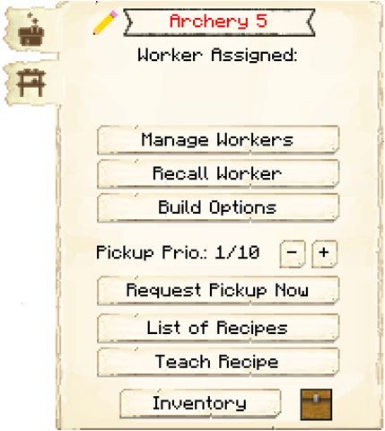

# Archery

    
    

    

        

        
<strong>Worker:</strong>

        

        

        
<a href="../workers/ranger">Ranger in Training</a>

        

    

    

    <recipe>archery</recipe>

## About the Archery

###  Note: The Archery can not be built until you have a Level 3 Barracks and finish the research in the [University](../..source/buildings/university)

The Archery is where your [Rangers in Training](../../source/workers/ranger) will train to become [Ranger Guards](../../source/workers/guard). This also allows them to level up without a risk of dying to mobs. The number of students that can be trained at a time depends on the level of the Archery. 

| Archery Level | Max # of Students |
| :----: | :----: |
| 1 | 1 |
| 2 | 2 |
| 3 | 3 |
| 4 | 4 |
| 5 | 5 |

The Rangers in Training require a bow to practice. They will shoot at targets, a bale of hay on a fence post. 

The Rangers in Training are not actual Guards even though they will be dressed as Ranger Guards. They will go to their own house at night to sleep. 

## Archery GUI

When accessing the Archery's hut block by right-clicking on it, you will see a GUI with different options:

 

  

    
   

  

     
    <ul>
      
        <li><strong>{{ item.button }}:</strong> {{ item.content }}</li>
      
    </ul>
  

  
   
  
