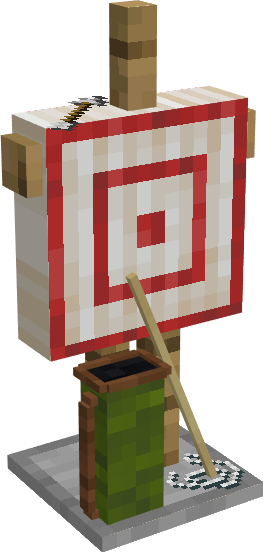

# Archery

    
    

    

        

        
<strong>Worker:</strong>

        

        

        
<a href="../workers/archerintraining">Archer in Training</a>

        

    

    

    <recipe>archery</recipe>

### Note: The Archery cannot be built until you have a level 3 [Barracks](../../source/buildings/barracks) (or three level 1 Barracks, or another equivalent) and have finished the research in the [University](../../source/buildings/university).
 

The Archery is where your Archers in Training will train to become [Archer Guards](../../source/workers/guard). This also allows them to level up without a risk of dying to mobs. A new Archer in Training will need a bed in a house in order to spawn. However, once they are hired at the Archery, that becomes their new residence and the bed in the house will open up for another new citizen (child or recruit).

The number of students that can be trained at a time depends on the level of the Archery. 

| Archery Level | Max # of Students |
| :----: | :----: |
| 1 | 1 |
| 2 | 2 |
| 3 | 3 |
| 4 | 4 |
| 5 | 5 |

The Archers in Training require a bow to practice. They will shoot at the practice targets, a target block (hay bale in 1.15) on a fence post. While shooting, they will try to stand at a place designated either by glowstone or by any block specially tagged as a standing point (tagging any block means that glowstone is ignored).

The Archers in Training are not actual Guards even though they will be dressed as Archer Guards. They will not help defend the colony.

## Archery GUI

When accessing the Archery's hut block by right-clicking on it, you will see a GUI with different options:

 

  

    
   

  

     
    <ul>
      
        <li><strong>{{ item.button }}:</strong> {{ item.content }}</li>
      
    </ul>
  

  
   

This is page two of the Archery GUI.

    

        
    

    

        <ul>
        <li><strong> Minimum Stock: </strong> Use this button to tell the Archery to keep a minimum stock on hand. Set items will be displayed above the button.</li>
        </ul>
    

