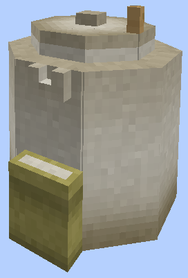
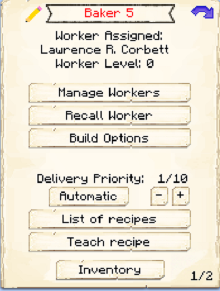

# Bakery

    
    

    

        

        
<strong>Worker:</strong>

        

        

        
<a href="../workers/baker">Baker</a>

        

    

    

    <recipe>baker</recipe>

Welcome to the Bakery’s Information Site.

Before you choose a place to build the Bakery, take into account the location from the Warehouse and/or Farmer(s). After you have selected a place for the hut you have to craft the Bakery Hut block and place it with the [Building Tool](../items/buildingtool). Once the Bakery Hut is placed, the Baker will be automatically assigned (or you can manually assign one with the best [Traits](../systems/workerinfo) for a Baker if you changed this in the setting tab in the [Town Hall's GUI](../../source/buildings/townhall).

Now you will have to issue the builder the “Build” assignment so it can build the “Baker’s Hut”. Once the builder is done you can now hire the Baker and the Baker can start crafting bread, cakes and cookies right away.

**Hint:** Once the build is done, you should think about upgrading the baker’s hut so that the worker can craft more bread, cakes and cookies at a faster pace.

  

## Hut GUI

When accessing the Baker's Hut block (right clicking on it) you will see a GUI with different options:

  

    
  

  

    
The Worker assigned and it's Level. (The worker levels up in time by working. The higher the level the faster and more efficient it will be). And the buttons:

    <ul>
      
        <li><strong>{{ item.button }}:</strong> {{ item.content }}</li>
      
    </ul>
  

   

  

    
  

  

    On page two of the GUI, you will see a list of recipes that the baker is able to make, just change the ones you want the baker to make to a ON and they will begin making those items as long as they recieve the required ingredients.
  

  
   
  
### **To see build options please see the [Builder](../../source/workers/builder) Page**  
