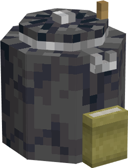
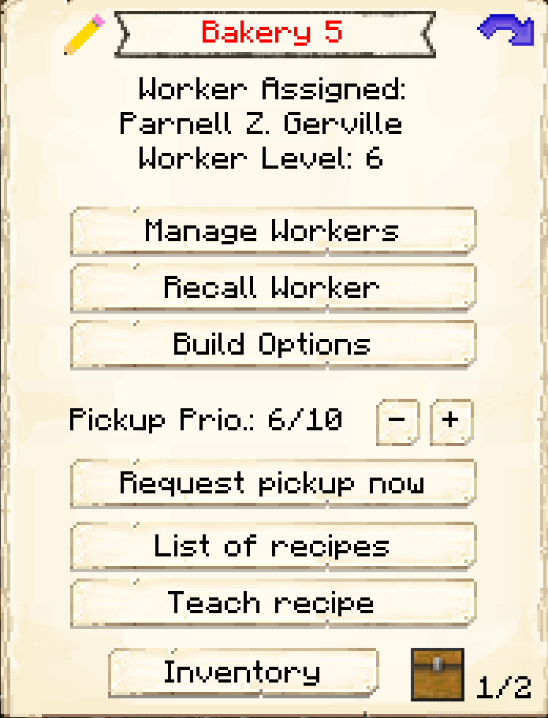
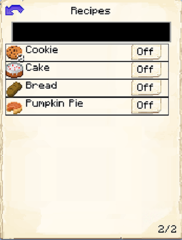

# Bakery

    
    

    

        

        
<strong>Worker:</strong> <a href="../workers/baker">Baker</a>

        

    

    

    

        

        
<strong>Recipe:</strong> 
        

    

    <recipe>bakery</recipe>
    

# About the Building

The Bakery is where the baker will make bread, cakes, cookies and pies.
  

**Note:** If you have a mod that changes the vanilla recipes, this will not affect the baker as the recipes are hard coded.

 

# Bakery GUI

After the building is built, you can access the Baker's Hut block (right clicking on it) you will see a GUI with different options:

  

    
  

  

    
The Worker assigned and it's Level. (The worker levels up in time by working. The higher the level the faster and more efficient it will be). And the buttons:

    <ul>
      
        <li><strong>{{ item.button }}:</strong> {{ item.content }}</li>
      
    </ul>
  

On page two of the GUI, you will see a list of recipes that the baker is able to make, just change the ones you want the baker to make to a yes and they will begin making those items as long as they recieve the required ingredients.
 
 

