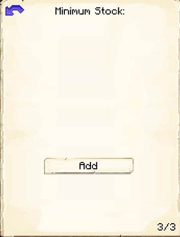

# Bakery

    
    

    

        

        
<strong>Worker:</strong>

        

        

        
<a href="../workers/baker">Baker</a>

        

    

    

    <recipe>baker</recipe>

The Baker will craft bread dough, cookie dough, cake dough, and raw pumpkin pie, then bake these in a furnace to create bread, cookies, cakes, and pumpkin pies. They will only do this upon request, whether from the [Cook](../../source/workers/cook), the [postbox](../../source/items/postbox), or as a minimum stock in the [Warehouse](../../source/buildings/warehouse).

The Baker can also craft some non-vanilla breads:

- Sweet bread, made from wheat and a honey bottle. Available at Bakery level 3. Has slightly higher saturation than normal bread, also gives you a speed boost and removes poison.
- Milk-infused bread, made from wheat and a milk bucket. Available at Bakery level 4. Removes all potion effects (like milk buckets do).
- Golden bread, made from wheat and a gold ingot. Available at Bakery level 5. Instantly heals 2 hearts.
- Chorus bread, made from wheat and a chorus fruit. Available after completing the Know the End research in the [University](../../source/buildings/university). Has higher saturation than normal bread and teleports you to the surface after eating it.

 

## Bakery GUI

  

    
    When accessing the Bakery's hut block by right-clicking on it, you will see a GUI with different options:

     
    

      

        
      

      

         
        <ul>
          
            <li><strong>{{ item.button }}:</strong> {{ item.content }}</li>
          
        </ul>
      

    

       

    This is page two of the Bakery GUI.

    

      

        
      

      

          <ul>
          <li><strong> Fuel: </strong> Listed here are items that can be used by the Baker as fuel in their furnaces. Simply turn on any that you want your Baker to use, and a <a href="../../source/workers/courier"> Courier</a> will deliver those items to the Baker when they need fuel. (The black box at the top is to search for items.)</li>
          </ul>
        

      

        

    This is page three of the Bakery GUI.

    

      

        
      

      

          <ul>
          <li><strong> Minimum Stock: </strong> Use this button to tell the Bakery to keep a minimum stock on hand. Set items will be displayed above the button. (It can be useful to set a minimum stock of dough, so the Baker can quickly bake items without needing to craft the dough first.)</li>
          </ul>
        

      

       
  

