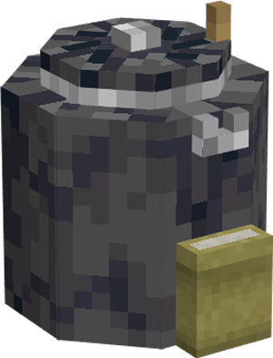
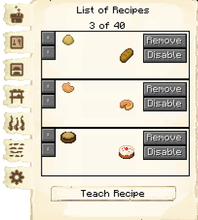
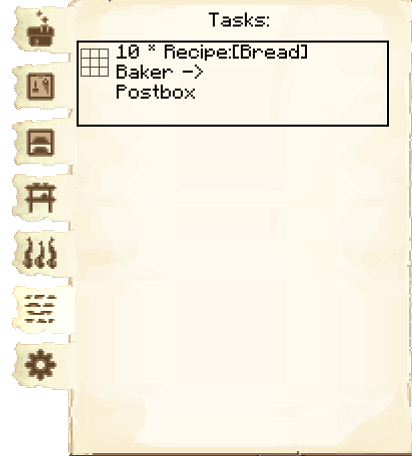

# Bakery

    
    

    

        

        
<strong>Worker:</strong>

        

        

        
<a href="../workers/baker">Baker</a>

        

    

    

    <recipe>baker</recipe>

The Baker will craft bread dough, cookie dough, cake dough, and raw pumpkin pie, then bake these in a furnace to create bread, cookies, cakes, and pumpkin pies. They will only do this upon request, whether from the [Cook](../../source/workers/cook), the [postbox](../../source/items/postbox), or as a minimum stock in the [Warehouse](../../source/buildings/warehouse).

The Baker can also craft some non-vanilla breads:

- Sweet bread, made from wheat and a honey bottle. Available at Bakery level 3. Has slightly higher saturation than normal bread, also gives you a speed boost and removes poison.
- Milk-infused bread, made from wheat and a milk bucket. Available at Bakery level 4. Removes all potion effects (like milk buckets do).
- Golden bread, made from wheat and a gold ingot. Available at Bakery level 5. Instantly heals 2 hearts.
- Chorus bread, made from wheat and a chorus fruit. Available after completing the Know the End research in the [University](../../source/buildings/university). Has higher saturation than normal bread and teleports you to the surface after eating it.

 

## Bakery GUI

  

    
    When accessing the Bakery's hut block by right-clicking on it, you will see a GUI with different options.   You start on the main tab:

     
    

      

        
      

      

         
        <ul>
          
            <li><strong>{{ item.button }}:</strong> {{ item.content }}</li>
          
        </ul>
      

    

 

  

    
  

  

     
    
The second tab of the GUI is <strong>Crafting Recipes</strong>.  Here you can see all the crafting recipes you have taught this hut and can remove them.

    <ul>
        <li><strong> Teach Recipe:</strong> When clicking teach recipe, it opens a crafting grid which allows you to teach this hut recipes (not the worker).</li>
    </ul>
  

 

  

    
  

  

     
    
The third tab of the GUI is <strong>Smelting Recipes</strong>.  Here you can see all the smelting recipes you have taught this hut and can remove them.

    <ul>
        <li><strong> Teach Recipe:</strong> When clicking teach recipe, it opens a furnace interface which allows you to teach this hut recipes (not the worker).</li>
    </ul>
  

 

  

        
  

  

     
    
The fourth tab of the GUI is <strong>Minimum Stock</strong>.  It has one button:

    <ul>
         <li><strong> Add: </strong> Use this button to tell the Bakery to keep a minimum stock on hand. Set items will be displayed above the button. (It can be useful to set a minimum stock of dough, so the Baker can quickly bake items without needing to craft the dough first.)</li>
    </ul>
  

 

  

        
  

  

     
    
The fifth tab of the GUI is <strong>Fuel</strong>.  Listed here are items that can be used by the Baker as fuel in their furnaces. Simply turn on any that you want your Baker to use, and a <a href="../../source/workers/courier"> Courier</a> will deliver those items to the Baker when they need fuel. (The black box at the top is to search for items.)

  

 

  

        
  

  

     
    
The sixth tab of the GUI is <strong>Tasks</strong>.  This tab shows you any requests the baker is working on, and where it is going.

  

 

  

        
  

  

     
    
The seventh tab of the GUI is <strong>Settings</strong>.

    <ul>
      <li><strong>Recipe Mode:</strong> This is unlocked by researching Warehouse Master in the [University](../../source/buildings/university).  This allows you to change the priority of recipes the hut chooses when it knows more than one recipe for an item.
        <ul>
          <li><strong>Priority:</strong>  This is the default setting.  The hut will try to use the recipe that is higher up in their recipe list first.</li>
          <li><strong>Warehouse Stock:</strong> The hut will look in the warehouse first to see what resource you have more of before deciding what recipe it will use.</li>
        </ul>
     </li>
    </ul>
    
For example: the sawmill has two recipes to make chests: one using 8 oak planks, and one using 8 spruce planks. In "Priority" mode, if the oak planks recipe is higher on the list, the carpenter would always use oak planks to make chests (even if there are none left). In "Warehouse Stock" mode, the carpenter would check to see that there are more spruce planks than oak planks in the warehouse before deciding to use spruce planks to make chests.

  

  

