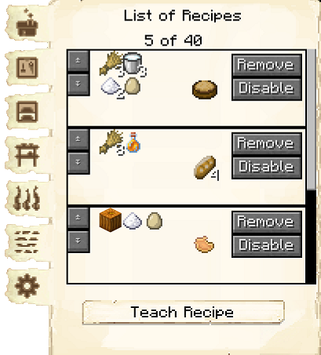

# Bakery

    
    

    

        

        
<strong>Worker:</strong>

        

        

        
<a href="../workers/baker">Baker</a>

        

    

    

    <recipe>baker</recipe>

# About the Bakery

The Bakery is where the Baker will bake bread, cakes, cookies, and pumpkin pies.

 

# Bakery GUI

When accessing the Bakery block by right-clicking on it, you will see a GUI with different options:

  

    
  

  

     
    <ul>
      <li><strong>Baker 5:</strong> This tells you the building you have selected is a Bakery with build level 5.</li>
      <li><strong>Worker Assigned:</strong> Tells you the worker assigned to the Bakery and their worker level. The worker levels up in time by working. The higher the level, the faster and more efficient they will be.</li>
      <li><strong>Manage Workers:</strong> Lets you change which worker is assigned to be the Baker. There can only be one Baker at each Bakery. <b>Note:</b> this only works if you have turned the worker hiring mode in the [Town Hall](../../source/buildings/townhall) block to manual, otherwise your citizens will be hired automatically.</li>
      <li><strong>Recall Worker:</strong> Recalls the Baker to their hut block. You might use it if they are stuck somewhere, you want to see what they have, or want to give them something directly.</li>
      <li><strong>Build Options:</strong> Lets you create a build, upgrade, reposition, or repair build order for the Bakery. To learn more about the building system, please visit the [Builder](../../source/workers/builder) page.</li>
      <li><strong>Delivery Priority:</strong> You can set the priority that a [deliveryman](../../source/workers/deliveryman) will visit this hut (ten is the highest, one is the lowest). You can also set whether it is automatic, meaning it changes automatically, or static, meaning it stays to what you set it no matter what.</li>
      <li><strong>List of Recipes and Teach Recipe:</strong> When clicking the list of recipes button, you see all the recipes you have taught this bakery and can remove them. When clicking teach recipe, it opens a 3x3 crafting grid which allows you to teach this bakery recipes (not the worker). <b>Note:</b> the bakery already knows the recipes for bread, cakes, cookies, and pumpkin pies without you having to teach them.</li>
      <li><strong>Inventory:</strong> Here you can access the hut block's storage, where the Baker takes their ingredients and deposits their baked goods. They will also use any [racks](../../source/decoblocks/rack) or chests in the bakery, so be sure to check those as well!</li>
    </ul>
  

   

On page two of the GUI, you will see a list of recipes that the Baker is able to make. Just click to change the ones you want the Baker to bake to on and they will begin making those items as long as they recieve the required ingredients. (The black box at the top is to search for recipes.)

**Note:** If you have a mod that changes the vanilla recipes, this won't affect the Baker, as the recipes are hard-coded.
 
 
