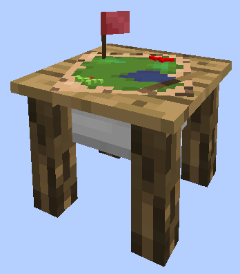

# Barracks

    
    

    

        

        
<strong>Worker:</strong>

        

        

        
<a href="../workers/guard">Guard</a>

        

    

    

    <recipe>barracks</recipe>

The Barracks building is the ultimate protection for your Town. The barracks will hold 4 (*YES* 4! ) [Barracks Towers](../buildings/barrackstower) within it's structure. Also, the Barracks Towers (unlike the normal Guard Towers) will employ and house 1 citizen for every level built! Each new guard will need a bed in a house in order to spawn, however, once they are hired at the barracks that becomes their new residence and the bed in the house will open up for another new citizen (child or recruit) to spawn. Each Barracks Towers will house and employ 5 guards, for a total of 20 guards for your colony.

Before you choose a place to build the Barracks, take into account the distances among the other buildings and obstacles like water, trees, caves, mountains, lava sources, etc.

After you have selected a place for the Barracks you have to craft the Barracks block in the crafting table and use your [Building Tool](../items/buildingtool) to place the building. Once you commit to the placement of the Barracks, the block will be placed.

You now officially have a Barracks, **CONGRATULATIONS!**

Now you will have to issue the builder the “Build” assignment so it can build the “Barracks”. It will be asking for the materials it needs. Make sure to check the “chat” regularly to see what materials the builder is requesting for any build/upgrade.

**Hint:** If you see the [Builder](../../source/workers/builder) has not finished building/upgrading your Barracks and you don’t see the builder asking for any materials, go to the builder’s hut and “recall” the builder and wait a bit to see what the builder needs. Watch the Minecraft “chat” section. Also you can go to page 2 of the builder’s hut GUI and check the list of materials required, any material in the list that is still missing will be in red colored letters.

<b>Note:</b> Once the builder is done you will have to create the build order for each Barracks Tower and build these up individually as well. The level of the Barracks Towers will dictate how far it can patrol, so if you want a longer patrol range, be sure to upgrade each Barracks Towers. Also there is a limit to the amount of Barracks Towers a Barrack can have built and also at what level the Barracks Tower can be built. They both depend on the level of the Barracks. Here you can see in more detail:

 

| Barracks Level | Max # of Barracks Towers | Max Level of Barracks Tower |
| :----: | :----: | :----: |
| 1 | 1 | 1 |
| 2 | 2 | 2 |
| 3 | 3 | 3 |
| 4 | 4 | 4 |
| 5 | 4 | 5 |

 

Now you can access the Barracks block (right click on it) and you will see a GUI with different options:

 

  

    
  

  
  
    
The Barracks and it's current Level. Will also keep track of and display the "Last Barbarian Spawns:". And the buttons:

    <ul>
      <li><strong>Build Options:</strong> This is the only option listed when clicking on the barracks hut, however, once you click on this, you will have the options to change the building (see next image)</li>
      <li><strong>Inventory:</strong> This is the most important button. Here you can access the buildings storage from where the worker takes and deposits materials, tools and anything they find along the way (citizens will pickup anything in their path that is considered a drop; saplings, seeds, rotten flesh, bones, arrows, etc.).</li>
    </ul>
  

  
   
  
### **To see build options please see the [Builder](../../source/workers/builder) Page**  

