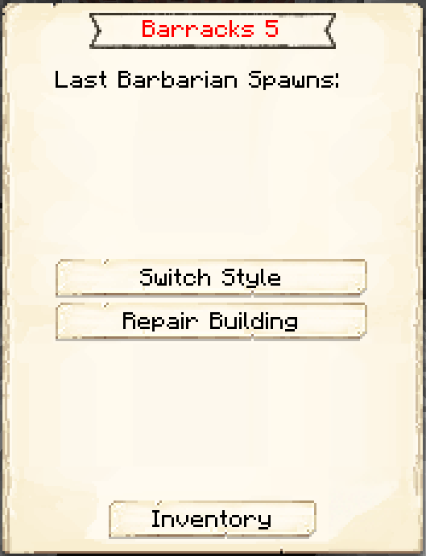
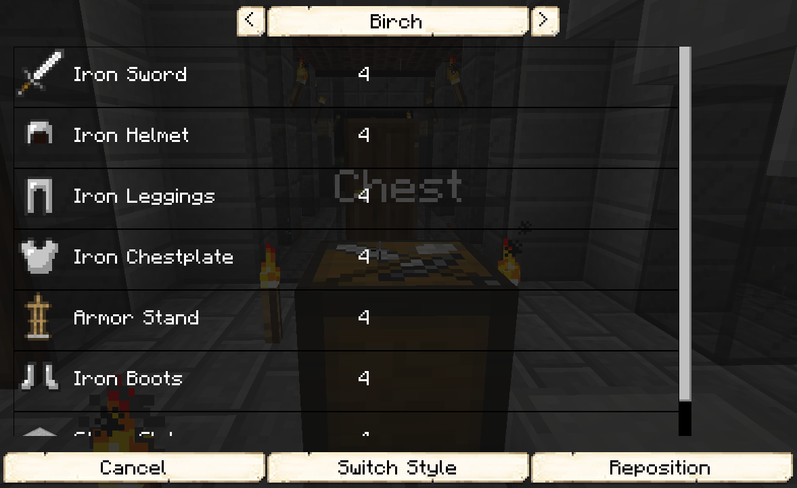

# Barracks

    
    

    

        

        
<strong>Worker:</strong>

        

        

        
<a href="../workers/guard">Guard</a>

        

    

    

    <recipe>barracks</recipe>

The Barracks building is the ultimate protection for your Town. The barracks will hold 4 (*YES* 4! ) [Guard Towers](../buildings/guardtower) within it's structure. Also, the Barracks Towers (unlike the normal Guard Towers) will spawn 1 new citizen for every level built! So if you have a full level 5 Barracks with all 4 Towers level 5 as well, you will have 20 additional citizens to employ as you like! Awesome, right? After they have spawned you will have to "Hire" them as guards in your Towers or any other worker type you want.

Before you choose a place to build the Barracks, take into account the distances among the other buildings and obstacles like water, trees, caves, mountains, lava sources, etc.

After you have selected a place for the Barracks you have to craft the Barracks block in the crafting table and use your [Building Tool](../items/buildingtool) to place the building. Once you commit to the placement of the Barracks, the block will be placed.

You now officially have a Barracks, **CONGRATULATIONS!**

Now you will have to issue the builder the “Build” assignment so it can build the “Barracks”. It will be asking for the materials it needs. Make sure to check the “chat” regularly to see what materials the builder is requesting for any build/upgrade.

**Hint:** If you see the [Builder](../../source/workers/builder) has not finished building/upgrading your Barracks and you don’t see the builder asking for any materials, go to the builder’s hut and “recall” the builder and wait a bit to see what the builder needs. Watch the Minecraft “chat” section. Also you can go to page 2 of the builder’s hut GUI and check the list of materials required, any material in the list that is still missing will be in red colored letters.

<b>Note:</b> Once the builder is done you will have to create the build order for each Guard Tower and build these up individually as well. The level of the Guard's Tower will dictate how far it can patrol, so if you want a longer patrol range, be sure to upgrade each Guard's Tower. Also there is a limit to the amount of Guard Towers a Barrack can have built and also at what level the Guard Tower can be built. They both depend on the level of the Barracks. Here you can see in more detail:

 

| Barracks Level | Max # of Guard Towers | Max Level of Guard Tower |
| :----: | :----: | :----: |
| 1 | 1 | 1 |
| 2 | 2 | 2 |
| 3 | 3 | 3 |
| 4 | 4 | 4 |
| 5 | 4 | 5 |

 

Now you can access the Barracks block (right click on it) and you will see a GUI with different options:

 

  

    
  

  
  
    
The Barracks and it's current Level. Will also keep track of and display the "Last Barbarian Spawns:". And the buttons:

    <ul>
      <li><strong>Switch Style:</strong> This is so you can change the schematic "style' you currently have built. You can change the style to see the list of items required for other styles, but it's not recommended that you build a different style from here since it will most likely be in a different position. As well as reposition the building, but other the Towers will most likely not be moved as this would move hte barracks only.</li>
      <li><strong>Repair Building:</strong> So the builder can recreate the original building (at the current level) and fix any broken, missing or unwanted addons to the original building..</li>
      <li><strong>Inventory:</strong> This is the most important button. Here you can access the buildings storage from where the worker takes and deposits materials, tools and anything they find along the way (citizens will pickup anything in their path that is considered a drop; saplings, seeds, rotten flesh, bones, arrows, etc.).</li>
    </ul>
  

 

After pressing the <b>Switch Style</b> button you now have a few options to consider:

 

  

    
  

  

    <ul>
      <li><strong>Schematic Style:</strong> (Birch in this image) Here you can verify the "style' of schematics you have currently. You can change the style to see the list of items required for other styles, but it's not recommended that you change a different style from here since it will most likely be in a different position. Since each schematic is different.</li>
      <li>This is the list of resources that the Builder will need for the schematic style selected.</li>
      <li><strong>Cancel Button</strong> To cancel this view screen and go back to the Barracks GUI page 1.</li>
      <li><strong>Switch Style Button</strong> When you are ready to "commit" to the build of this selected schematic style.</li>
      <li><strong>Reposition Button</strong> To Move the building from it's current location. After pressing this button you will be taken to the 3D view of the building tool GUI so you can move it to where you want it.</li>
    </ul>
  

  

