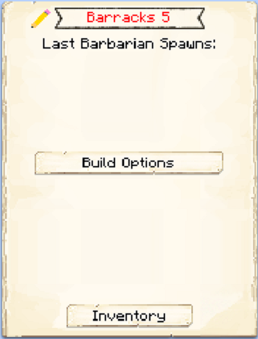
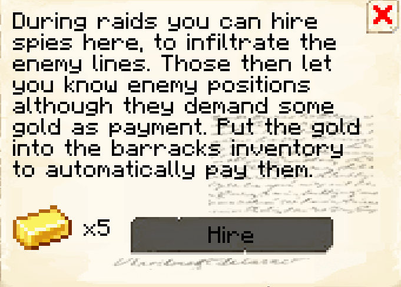

# Barracks

    
    

    

        

        
<strong>Worker:</strong>

        

        

        
<a href="../workers/guard">Guard</a>

        

    

    

    <recipe>barracks</recipe>

# About the Building

The Barracks building is the ultimate protection for your Town. The barracks will hold 4 (*YES* 4! ) [Barracks Towers](../buildings/barrackstower) within it's structure. Also, the Barracks Towers (unlike the normal Guard Towers) will employ and house 1 citizen for every level built! Each new guard will need a bed in a house in order to spawn, however, once they are hired at the barracks that becomes their new residence and the bed in the house will open up for another new citizen (child or recruit). Each Barracks Towers will house and employ 5 guards, for a total of 20 guards for your colony.

| Barracks Level | Max # of Guard Towers | Max Level of Guard Tower |
| :----: | :----: | :----: |
| 1 | 1 | 1 |
| 2 | 2 | 2 |
| 3 | 3 | 3 |
| 4 | 4 | 4 |
| 5 | 4 | 5 |

 

# Barracks Gui

Once the building is built, you can access the Barracks block (right click on it) and you will see a GUI with different options:

 

  

    
  

  
  
    
The Barracks and it's current Level. Will also keep track of and display the "Last Barbarian Spawns:". And the buttons:

    <ul>
      <li><strong>Build Options:</strong> This option will allow you to upgrade, or repair the building</li>
      <li><strong>Hire Spies:</strong> This option is only available after the hut is level 3, Here you can hire spies during raids.</li>  
      <li><strong>Inventory:</strong> This is the most important button. Here you can access the buildings storage from where the worker takes and deposits materials, tools and anything they find along the way (citizens will pickup anything in their path that is considered a drop; saplings, seeds, rotten flesh, bones, arrows, etc.).</li>
    </ul>
  

  
   
   
  
  
  
### **To see build options please see the [Builder](../../source/workers/builder) Page** 
