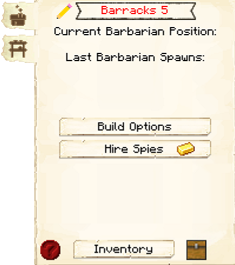

# Barracks

    
    

    

        

        
<strong>Worker:</strong>

        

        

        
<a href="../workers/guard">Guard</a>

        

    

    

    <recipe>barracks</recipe>

## About the Barracks

The Barracks is the ultimate protection for your colony. The Barracks will hold 4 [Barracks Towers](../buildings/barrackstower) within its structure. The Barracks Towers (unlike the normal [Guard Towers](../../source/buildings/guardtower)) will employ *and* house 1 [Guard](../../source/workers/guard) for every level built! Each new Guard will need a bed in a house in order to spawn. However, once they are hired at the Barracks Tower, that becomes their new residence and the bed in the house will open up for another new citizen. Each Barracks Tower can house and employ 5 Guards for a total of 20 Guards for your colony.

| Barracks Level | Max # of Barracks Towers | Max Level of Barracks Towers |
| :----: | :----: | :----: |
| 1 | 1 | 1 |
| 2 | 2 | 2 |
| 3 | 3 | 3 |
| 4 | 4 | 4 |
| 5 | 4 | 5 |

 

<strong>Note:</strong> If you place Barracks/Barracks Towers near your colony border and level them up, your border will expand.

 

## Barracks GUI

When accessing the Barracks' hut block by right-clicking on it, you will see a GUI with different options:

 

  

    
  

  
  
      <ul>
      <li><strong>Barracks Level:</strong> This tells you the type of hut and the build level of the building you have selected.</li>         <li><strong>Current Barbarian Position and Last Barbarian Spawn:</strong> A tracker system for Barbarians. <strong>Note: </strong>you can only see the current barbarian position if you have <b>hired spies</b> (see below) during the current raid.</li>
      <li><strong>Build Options:</strong> Lets you create a build, upgrade, reposition, or repair build order for the Barracks. To learn more about the building system, please visit the [Builder](../../source/workers/builder) page.</li>
      <li><strong>Hire Spies:</strong> This option is only available after the hut is level 3. Here you can hire spies during raids: </li>  
       
  
       
      <li><strong>Inventory:</strong> Here you can access the Barracks' storage, where the Guards staying in the Barracks take and deposit materials. They will also use any [racks](../../source/decoblocks/rack) or chests in the Barracks, so be sure to check those as well!</li>
    </ul>
  

  
   
