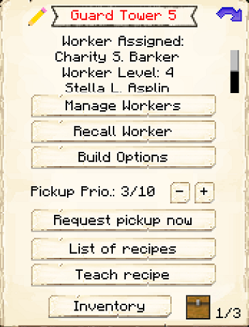
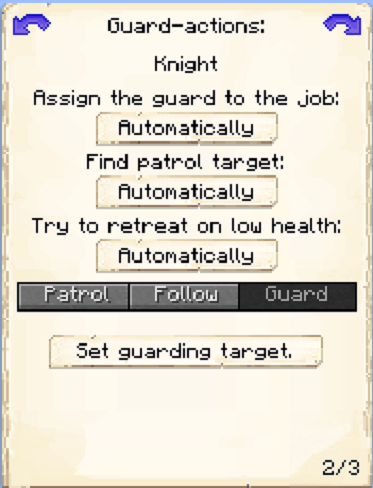
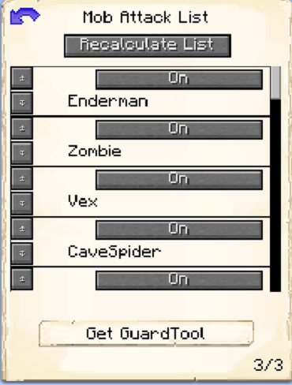

# Barracks Tower

    
    

    

        

        
<strong>Worker:</strong>

        

        

        
<a href="../workers/guard">Guard</a>

        

    

The Barracks Towers will employ and house 1 [Guard](../../source/workers/guard) for every level built (unlike the normal [Guard Towers](../../source/buildings/guardtower), which can only have 1 Guard at a time). Each new Guard will need a bed in a house in order to spawn. However, once they are hired at the Barracks Tower, that becomes their new residence and the bed in the house will open up for another new citizen (child or recruit).

| Barracks Tower Level | Max # of Guards |
| :----: | :----: |
| 1 | 1 |
| 2 | 2 |
| 3 | 3 |
| 4 | 4 |
| 5 | 5 |

The Barracks Tower locations are predetermined by the [Barracks](../../source/buildings/barracks) that you choose. They are placed in specific locations to fit within the Barracks. 

| Barracks Level | Max # of Barracks Towers | Max Level of Barracks Towers |
| :----: | :----: | :----: |
| 1 | 1 | 1 |
| 2 | 2 | 2 |
| 3 | 3 | 3 |
| 4 | 4 | 4 |
| 5 | 4 | 5 |

 

<strong>Note:</strong> If you place Barracks/Barracks Towers near your colony border and level them up, your border will expand.

 

## Barracks Tower GUI

When accessing the Barracks Tower's hut block by right-clicking on it, you will see a GUI with different options:

 

  

    
  

  
  
     
    <ul>
      
        <li><strong>{{ item.button }}:</strong> {{ item.content }}</li>
      
    </ul>  
  

 

This is page two of the GUI.

 

  

     
    
  

  

    <ul>
        <li><strong>Knight or Archer:</strong> This is where you can choose if you want the Guard(s) to be a Knight or an Archer-just click to change the setting. The difference between the two is that Knights use swords, while Archers use bows. <b>Note:</b> You can only change this if you have turned the <strong>Assign the Guard to the Job</strong> setting to manually.</li>
        <li><strong>Patrol, Follow, or Guard:</strong> This is where you can choose if you want the Guard(s) to patrol, follow, or guard.</li>      
        <ul>
        <li>If you set it to Guard, you can set one area for the Guard(s) to stay in. You can set the area by clicking <b>Set Guarding Target</b>, which will spawn a Guard-scepter in your inventory. Right-clicking on a block with the Guard-scepter will set it as the guard spot. </li>
        <li>If you set it to Follow, the Guard(s) will follow you around as your personal bodyguard protecting you or fighting alongside you. They will even go outside the colony when following! If you choose <b>Loose Grouping</b>, the Guard(s) will stay close to you, but not as close as if you choose <b>Tight Grouping</b>.</li>
        <li>If you set it to Patrol, you have a couple different options. </li>
        <ul>
            <li>If you set <strong>Find Patrol Target</strong> to automatically, the Guard(s) will patrol from hut to hut and back to their tower.</li>
            <li>If you set <strong>Find Patrol Target</strong> to manually, you can set the patrol route when you click on <b>Set Patrol Positions</b>. Clicking on it will spawn a Guard-scepter in your inventory. You can right-click using the Guard-scepter to set patrol positions for the Guard(s) to patrol between. To delete patrol positions, simply get a new Guard-scepter and click a new patrol position. The old ones should disappear.</li>
      </ul>
    </ul>
        <li><strong>Try to Retreat on Low Health:</strong> Here you can choose if the Guard will retreat when they have low health, if possible. You can choose from Off or On.  

 
 
 
 
 
 
 
 
 
 

On the third page of the GUI you can tell the Guard which mobs to attack and which ones to ignore. You can also choose the priority of each mob by moving them up or down in the list. The default order is reverse alphabetically.

  

     
    
  

  

