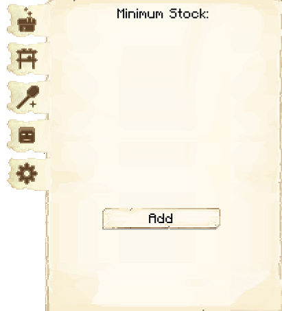

# Barracks Tower

    
    

    

        

        
<strong>Worker:</strong>

        

        

        
<a href="../workers/guard">Guard</a>

        

    

# About the Barracks Tower

The Barracks Towers will employ and house 1 [Guard](../../source/workers/guard) for every level built (unlike the normal [Guard Towers](../../source/buildings/guardtower), which can only have 1 Guard at a time). Each Barracks Tower will house and employ 5 Guards at the highest level. Each new Guard will need a bed in a house in order to spawn, however, once they are hired at the Barracks Tower that becomes their new residence and the bed in the house will open up for another new citizen (child or recruit).

The Barracks Tower locations are predetermined by the [Barracks](../../source/buildings/barracks) that you choose. They are placed in specific locations to fit within the Barracks. 

| Barracks Level | Max # of Barracks Towers | Max Level of Barracks Towers |
| :----: | :----: | :----: |
| 1 | 1 | 1 |
| 2 | 2 | 2 |
| 3 | 3 | 3 |
| 4 | 4 | 4 |
| 5 | 4 | 5 |

 

# Barracks Tower GUI

When accessing the Barracks Tower's hut block by right-clicking on it, you will see a GUI with different options:

 

  

    
  

  
  
     
    <ul>
      
        <li><strong>{{ item.button }}:</strong> {{ item.content }}</li>
      
    </ul>  
  

 

This is page two of the GUI.

 

  

     
    
  

  

    <ul>
      <li><strong></strong> When you select this mode you have two options: </li>
    </ul>
  

 

On the third page of the GUI you can tell the Guard who to attack and who to ignore. You can also choose the priority of each mob by moving them up or down in the list.

  

     
    
  

  

