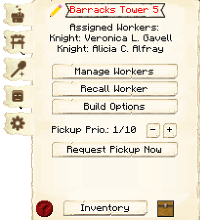
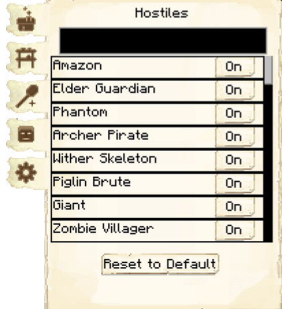
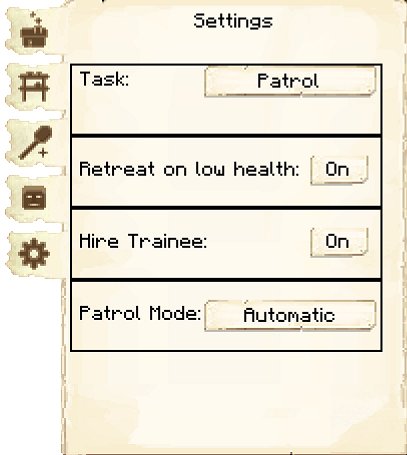

# Barracks Tower

    
    

    

        

        
<strong>Worker:</strong>

        

        

        
<a href="../workers/guard">Guard</a>

        

    

The Barracks Towers will employ and house 1 [Guard](../../source/workers/guard) for every level built (unlike the normal [Guard Towers](../../source/buildings/guardtower), which can only have 1 Guard at a time). Each new Guard will need a bed in a house in order to spawn. However, once they are hired at the Barracks Tower, that becomes their new residence and the bed in the house will open up for another new citizen (child or recruit).

| Barracks Tower Level | Max # of Guards |
| :----: | :----: |
| 1 | 1 |
| 2 | 2 |
| 3 | 3 |
| 4 | 4 |
| 5 | 5 |

The Barracks Tower locations are predetermined by the [Barracks](../../source/buildings/barracks) that you choose. They are placed in specific locations to fit within the Barracks. 

| Barracks Level | Max # of Barracks Towers | Max Level of Barracks Towers |
| :----: | :----: | :----: |
| 1 | 1 | 1 |
| 2 | 2 | 2 |
| 3 | 3 | 3 |
| 4 | 4 | 4 |
| 5 | 4 | 5 |

 

Guard(s) will patrol a set distance around their tower, which is based on their tower's level.

| Tower Level | Max Patrol Distance |
| ----------- | ------------------- |
| 1 | 80 blocks |
| 2 | 110 blocks |
| 3 | 140 blocks |
| 4 | 170 blocks |
| 5 | 200 blocks |

<strong>Note:</strong> If you place Barracks/Barracks Towers near your colony border and level them up, your border will [expand](../../source/systems/border).

 

## Barracks Tower GUI

When accessing the Barracks Tower's hut block by right-clicking on it, you will see a GUI with different options.   You start on the main tab:

   
  

    

      
    

    
  
       
      <ul>
        
          <li><strong>{{ item.button }}:</strong> {{ item.content }}</li>
        
      </ul>  
    

  

 

  

      
  

  

     
    
The second tab of the GUI is <strong>Minimum Stock</strong>.    It has one button:

    <ul>
        <li><strong> Minimum Stock: </strong> Use this button to tell the Barracks Tower to keep a minimum stock on hand. Set items will be displayed above the button.</li>
    </ul>
  

  

 

  

      
  

  

     
    
The third tab of the GUI is <strong>Guard Scepter</strong>.    It has one button:

    <ul>
        <li><strong> Obtain Tool: </strong> Clicking on it will spawn a Guard-scepter in your inventory. You can right-click using the Guard-scepter to set patrol positions for the Guard(s) to patrol between. To delete patrol positions, simply get a new Guard-scepter and click a new patrol position. The old ones should disappear.</li>
    </ul>
  

  

 

  

      
  

  

     
    
The fourth tab of the GUI is <strong>Hostiles</strong>. You can tell the Guard which mobs to attack and which ones to ignore. By default, all hostile mobs are turned on.

  

  

 

  

      
  

  

     
    
The fifth tab of the GUI is <strong>Settings</strong>.

      <ul>
        <li><strong>Task:</strong> This is where you can choose if you want the Guard(s) to patrol, follow, or guard.</li>  
        <ul>
          <li><strong>Patrol:</strong>  You have a couple different options. </li>
          <ul>
              <li>If you set <strong>Find Patrol Target</strong> to automatically, the Guard(s) will patrol from hut to hut and back to their tower.</li>
              <li>If you set <strong>Find Patrol Target</strong> to manually, you can set the patrol route when you click on <b>Set Patrol Positions</b>. Clicking on it will spawn a Guard-scepter in your inventory. You can right-click using the Guard-scepter to set patrol positions for the Guard(s) to patrol between. To delete patrol positions, simply get a new Guard-scepter and click a new patrol position. The old ones should disappear.</li>
         </ul>
          <li><strong>Guard:</strong> You can set one area for the Guard(s) to stay in. You can set the area by clicking <b>Set Guarding Target</b>, which will spawn a Guard-scepter in your inventory. Right-clicking on a block with the Guard-scepter will set it as the guard spot. </li>
          <li><strong>Follow:</strong> The Guard(s) will follow you around as your personal bodyguard protecting you or fighting alongside you. They will even go outside the colony when following! If you choose <b>Loose Grouping</b>, the Guard(s) will stay close to you, but not as close as if you choose <b>Tight Grouping</b>.</li>
          <li><strong>Patrol Mine:</strong> Allows you to assign Guard(s) to a mine.  You will have to visit the mine and assign the guards there.</li> 
        </ul>
        <li><strong>Retreat on Low Health:</strong> Here you can choose if the Guard(s) will retreat when they have low health, if possible. You can choose from Off or On.</li>
        <li><strong>Hire Trainee:</strong> If there is a vacancy at this tower, here is where you can choose if you want a Guard to be hired from the respective training facility (<a href="../../source/buildings/archery">Archery</a> for Archers and <a href="../../source/buildings/combatacademy"> Combat Academy</a> for knights) instead of an unemployed colonist. (This setting only matters if Assign Colonists to Jobs is turned to Automatic in the <a href="../../source/buildings/townhall"> Town Hall</a> GUI.)</li>
        <li>This option changes depending on what Task is set, and allows you change the settings for that task.</li>
      </ul>
  

  
