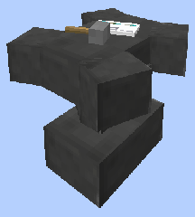

# Blacksmith

    
    

    

        

        
<strong>Worker:</strong>

        

        

        
<a href="../workers/blacksmith">Blacksmith</a>

        

    

    

    <recipe>blacksmith</recipe>

Welcome to the Blacksmith Information Site.

Before you choose a place to build the Blacksmith, take into account the location from Mine, Warehouse and/or other Worker(s). After you have selected a place for the Hut, you have to craft the Blacksmith's Hut block and place it with your [Building Tool](../items/buildingtool). Once the hut block is placed, the Blacksmith will be automatically assigned (or you can manually assign one with the best  [Traits](../systems/workerinfo) for Blacksmith if you changed this in the settings tab in the [Town Hall's GUI](../../source/buildings/townhall).

Now you will have to issue the builder the “Build” assignment so it can build the “Blacksmith’s Hut”. Once the builder is done you can now hire the Blacksmith and begin teaching them the recipes you would like them to create. 

The Blacksmith is a 3x3 crafter and can make any vanilla tools, armor and swords (No bows or redstone items). The Blacksmith will work when they receive a request for any of those items for all of your Colony's needs.

**Hint:** Once the builder is done you will want to upgrade the Blacksmith to get all the awesome perks it has to offer for higher levels. So:

| Building Level | Number of Recipes |
| :-----: | :-----: |
| 1 | 10 | 
| 2 | 20 |
| 3 | 40 |
| 4 | 80 | 
| 5 | 160 | 

## Hut GUI

When accessing the Blacksmith's Hut block (right clicking on it), you will see a GUI with different options:

 

  

    
  

  

    
The Worker assigned and it's Level. (The worker levels up in time by doing it's work. The higher the level the faster and more efficient it will be). And the buttons:

    <ul>
      
        <li><strong>{{ item.button }}:</strong> {{ item.content }}</li>
      
    </ul>
  

  
   
  
### **To see build options please see the [Builder](../../source/workers/builder) Page**  
