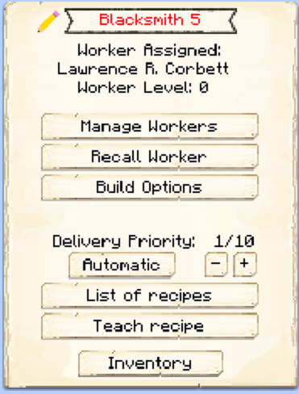

# Blacksmith's Hut

    
    

    

        

        
<strong>Worker:</strong>

        

        

        
<a href="../workers/blacksmith">Blacksmith</a>

        

    

    

    <recipe>blacksmith</recipe>

# About the Blacksmith's Hut

The Blacksmith is a 3x3 crafter and can make any vanilla tools, armor and swords, and shields (no bows or redstone items). The Blacksmith will work when they receive a request for any of those items from another worker. 

**Note:** You will need to teach the Blacksmith the recipes of the items you want them to create. The number of items the blacksmith can learn are listed below.

| Building Level | Number of Recipes |
| :-----: | :-----: |
| 1 | 10 | 
| 2 | 20 |
| 3 | 40 |
| 4 | 80 | 
| 5 | 160 | 

# Blacksmith's Hut GUI

When accessing the Blacksmith's Hut block by right clicking on it, you will see a GUI with different options:

 

  

    
  

  

      
    <ul>
      <li><strong>Blacksmith 5:</strong> This tells you the building you have selected is a Blacksmith's Hut with build level 5.</li>
      <li><strong>Worker Assigned:</strong> Tells you the worker assigned to the Blacksmith's Hut and their worker level. The worker levels up in time by working. The higher the level, the faster and more efficient they will be.</li>
      <li><strong>Manage Workers:</strong> Lets you change which worker is assigned to be the Blacksmith. There can only be one Blacksmith at a time. <b>Note:</b> this only works if you have turned the worker hiring mode in the [Town Hall](../../source/buildings/townhall) block to manual, otherwise your citizens will be hired automatically.</li>
      <li><strong>Recall Worker:</strong> Recalls the Blacksmith to their hut block. You might use it if they are stuck somewhere, you want to see what they have, or want to give them something directly.</li>
      <li><strong>Build Options:</strong> Lets you create a build, upgrade, reposition, or repair build order for the Blacksmith's Hut. To learn more about the building system, please see the [Builder](../../source/workers/builder) page.</li>
      <li><strong>Delivery Priority:</strong> You can set the priority that a [deliveryperson](../../source/workers/deliveryman) will deliver requested materials and take finished crafts to the [warehouse](../../source/buildings/warehouse) (ten is the highest, one is the lowest). You can also set whether it is automatic, meaning it changes automatically based on if the blacksmith has any requests (among other factors), or static, meaning it stays to what you set it no matter what.</li>
      <li><strong>List of Recipes and Teach Recipe:</strong> When clicking the list of recipes button, you see all the recipes you have taught this Blacksmith's Hut and can remove them. When clicking teach recipe, it opens a 3x3 crafting grid which allows you to teach this hut recipes (not the worker). <b>Note:</b> you will need to teach the blacksmith all the recipes you want them to be able to craft.</li>
      <li><strong>Inventory:</strong> Here you can access the hut block's storage, where the blacksmith takes their materials and deposits their finished crafts. They will also use any racks or chests in the hut, so be sure to check those as well!</li>
    </ul>
  

  
   
  
