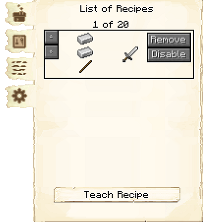
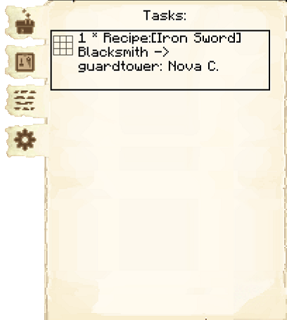
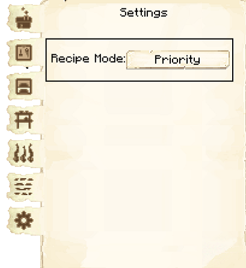

# Blacksmith's Hut

    
    

    

        

        
<strong>Worker:</strong>

        

        

        
<a href="../workers/blacksmith">Blacksmith</a>

        

    

    

    <recipe>blacksmith</recipe>

### Note: The Blacksmith's Hut cannot be built until you have a level 3 [Mine](../../source/buildings/mine) (or three level 1 Mines, or another equivalent) and have finished the research in the [University](../../source/buildings/university).
 

The Blacksmith is a 3x3 crafter and can make any vanilla tools, armor, swords, and shields (no bows or redstone items). The Blacksmith will work when they receive a request for any of those items from another worker. 

**Note:** You will need to teach the Blacksmith the recipes of the items you want them to create. The number of items the Blacksmith can learn are listed below:

| Building Level | Number of Recipes |
| :-----: | :-----: |
| 1 | 10 | 
| 2 | 20 |
| 3 | 40 |
| 4 | 80 | 
| 5 | 160 | 

Additionally, upon reaching level 5, the Blacksmith learns the nine netherite recipes (shovel, hoe, pickaxe, axe, sword, helmet, chestplate, leggings, and boots), which count toward the recipe total above.

When a colonist is requesting a tool from the Blacksmith with multiple accepted levels, the Blacksmith will craft whichever tool type is highest in their list of recipes that they have the materials for (when you teach them a new recipe, it'll go on the bottom).

## Blacksmith's Hut GUI

 

When accessing the Blacksmith's Hut block by right-clicking on it, you will see a GUI with different options. You start on the main tab :

 

  

    
  

  

     
    <ul>
      
        <li><strong>{{ item.button }}:</strong> {{ item.content }}</li>
      
    </ul>
  

  

 

  

    
  

  

     
    
 The second tab of the GUI is <strong>Crafting Recipes</strong>.  Here you can see all the crafting recipes you have taught this hut and can remove them.

    <ul>
        <li><strong> Teach Recipe:</strong> When clicking teach recipe, it opens a crafting grid which allows you to teach this hut recipes (not the worker).</li>
    </ul>
  

 

  

    
  

  

     
    
 The third tab of the GUI is <strong>Tasks</strong>.  This tab shows you any requests the blacksmith is working on, and where it is going.

  

 

  

        
  

  

     
    
 The fourth tab of the GUI is <strong>Settings</strong>.  This is currently not in use for this hut.

  

  

  
