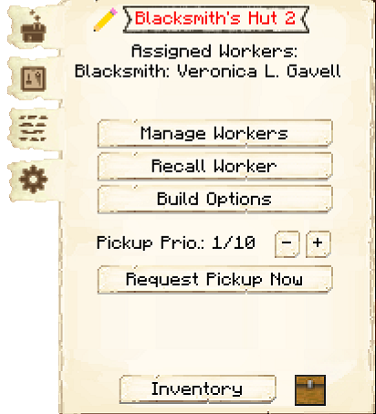

# Blacksmith

    
    

    

        

        
<strong>Worker:</strong> <a href="../workers/blacksmith">Blacksmith</a>

        

    

    

    

        

        
<strong>Recipe:</strong> 
        

    

    <recipe>blacksmith</recipe>

# About the Building

The Blacksmith is a 3x3 crafter and can make any vanilla tools, armor and swords, and shields (No bows or redstone items). The Blacksmith will work when they receive a request for any of those items for all of your Colony's needs. 

**Note:** You will need to teach the Blacksmith the recipes of the items you want them to create. The number of items the blacksmith can learn are listed below.

| Building Level | Number of Recipes |
| :-----: | :-----: |
| 1 | 10 | 
| 2 | 20 |
| 3 | 40 |
| 4 | 80 | 
| 5 | 160 | 

# Blacksmith's Hut GUI

After the building is built, you can access the Blacksmith's Hut block (right clicking on it), you will see a GUI with different options:

 

  

    
  

  

    
The Worker assigned and it's Level. (The worker levels up in time by doing it's work. The higher the level the faster and more efficient it will be). And the buttons:

    <ul>
      
        <li><strong>{{ item.button }}:</strong> {{ item.content }}</li>
      
    </ul>
  

  
   
  
### **To see build options please see the [Builder](../../source/workers/builder) Page**  
