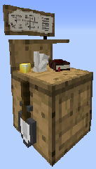

# Builder's Hut

    
    

    

        

        
<strong>Worker:</strong>

        

        

        
<a href="../workers/builder">Builder</a>

        

    

    

    <recipe>builder</recipe>

Welcome to the Builder’s Hut Information Site.

**Before you build *any* building, you need to build the Builder's Hut. Without the builder’s hut being built, the builder cannot build any other building.**

Before you choose a place to build it's Hut, take into account the distances among the other buildings and obstacles like water, trees, caves, mountains, lava sources, etc. After you have selected a place for the Hut, you have to craft the Builder’s Hut block and place it with your [Building Tool](../items/buildingtool). Once the hut is placed, the builder will be automatically assigned (or you can manually assign one with the best [Traits](../systems/workerinfo) for a builder if you changed this in the settings tab in the [Town Hall's GUI](../../source/buildings/townhall).

Now you will have to issue the “Build” assignment so it can build it's own hut first. The builder will be asking for the materials it needs. Make sure to check the “chat” regularly to see what materials the builder is requesting for any build/upgrade.

Once the builder is done you can now start to build anything you want; Worker huts, buildings, decorations or your own schematics.

- **Note:** The Builder may *ONLY* build or upgrade any other Worker's hut up to the level of it's own hut. So, in order for the builder to upgrade any building, the Builder's Hut *MUST* be upgraded first. Then it will be able to upgrade any other building(s).

## Hut GUI

When accessing the Builder’s Hut block (right clicking on it) you will see a GUI with different options:

 

  

    
  

   
  

    
The Worker assigned and it's Level. (The worker levels up in time by working. The higher the level the faster and more efficient it will be). And the buttons:

    <ul>
      
        <li><strong>{{ item.button }}:</strong> {{ item.content }}</li>
      
    </ul>
  

 

  

    
  

  
    
    
By pressing the arrow button in the top right corner of the GUI, you will be taken to page 2 of the GUI where you will find the following:

    <ul>
      <li><strong>Required Resources:</strong> These are the resource that the Builder will need for the Build/Upgrade it is currently working on. This amount will change as it places the blocks and will show <strong>only</strong> what blocks it still needs to place. The blocks in Red color are the ones neither you nor the builder has in it's inventory</li>  
      <li><strong>Inventory:</strong> Same as above, allows you to view the huts storage.</li>
    </ul>
  

 

<b>Important Note:</b> After pressing the <i>Build Options</i> button you will see a new list of all the items required for that build. There are some options here, but the most important option is that you <i>HAVE To CONFIRM</i> the Build by pressing the <b>Build Building</b> button so the build order is created.

After pressing the <b>Build Options</b> button you have a few options to consider:

  

  

    
  

  

    <ul>
       <ul>
      
        <li><strong>{{ item.button }}:</strong> {{ item.content }}</li>
      
    </ul>
    </ul>
  

  

## A few things to consider

For the placement of the Builder's Hut, you should consider having the hut in the middle of where you plan to have the rest of your buildings so that the builder has less of a distance to walk between it's hut and the build sites.

The builder will not start another build assignment until it has finished the current one.

You can go to the [Town Hall's GUI](../../source/buildings/townhall) and click on the Work Orders tab and cancel the current build as well as arrange the priorities of the other build orders you have there. If you cancel a work order, (and it was being built already) when you assign the build order again, the builder will continue where it left off.

Any block the builder removes (dirt, wood, planks, glass, etc.) while building and/or upgrading it will keep it in it's inventory until the inventory becomes full, or it may dump any unnecessary items at the end of a build/upgrade into the Builder's Hut Inventory.
  
