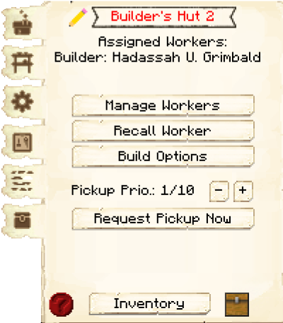

# Builder's Hut

    
    

    

        

        
<strong>Worker:</strong>

        

        

        
<a href="../workers/builder">Builder</a>

        

    

    

    <recipe>builder</recipe>

### Before you build *any* other building, you must build the Builder's Hut. If the Builder’s Hut is not built, the Builder cannot build other buildings.

Before you choose a place to build the Builder's Hut, take into account the distances among the other possible building sites and obstacles like water, trees, caves, mountains, lava sources, etc. After you have selected a place for the hut, you have to craft the Builder’s Hut block and place it with your [Building Tool](../items/buildingtool). Once the hut is placed, the Builder will be automatically assigned (or you can manually assign one with the best [Traits](../systems/workerinfo) for a Builder if you changed this in the settings tab in the [Town Hall's GUI](../../source/buildings/townhall).

Now you will have to issue the build assignment so the Builder can build their own hut first. The Builder will ask for the materials they need. Make sure to check the [Resource Scroll](../../source/items/resourcescroll) or the second page of the [Builder's Hut](../../source/buildings/builder) to see what materials the Builder is requesting for any build/upgrade. Any material in the list that is still missing will be in red letters.

Once the Builder's Hut is built you can now build anything you want, like worker huts, buildings, decorations, or your own schematics.

- **Note:** The Builder can only build or upgrade any other hut up to the level of their own hut. So, in order for the Builder to upgrade any building, the Builder's Hut must be upgraded first. Then the Builder will be able to upgrade any other building(s).

## Builder's Hut GUI

When accessing the Builder’s Hut block by right-clicking on it, you will see a GUI with different options:

 

  

    
  

   
  

     
    <ul>
      
        <li><strong>{{ item.button }}:</strong> {{ item.content }}</li>
      
    </ul>
  

 
 
    
By pressing the arrow button in the top right corner of the GUI, you will be taken to page 2 of the GUI where you will find the following:

  

 

  

    
  

 

<li><strong>Required Resources:</strong> These are the resources that the Builder will need for the build order they are currently working on. This amount will change as they place blocks and will show <strong>only</strong> what blocks the Builder still needs to place. The blocks in red are the ones neither you nor the Builder has in their inventory.</li>
 
 

<b>Important Note:</b> After pressing the <b>BUILD</b> button you will see a new list of all the items required for that build. There are some options here, but the most important option is that you <i>MUST CONFIRM</i> the build by pressing the <b>Build Building</b> button so the build order is created.

<b>Important Note:</b> After pressing the <b>UPGRADE</b> button you will see a new list of all the items required for that build. There are some options here, but again, the most important option is that you <i>MUST CONFIRM</i> the upgrade by pressing the <b>Upgrade Building</b> button so the build order is created.

After pressing the <b>Build Options</b> button you have a few options to consider:

 

  

    
  

  

    <ul>
       <ul>
      
        <li><strong>{{ item.button }}:</strong> {{ item.content }}</li>
      
    </ul>
    </ul>
  

  

### A few things to consider

For the placement of the Builder's Hut, you should consider having the hut in the middle of where you plan to have the rest of your buildings so that the Builder has less of a distance to walk between their hut and the build sites.

The Builder will not start another build assignment until they have finished the current one.

You can go to the [Town Hall's GUI](../../source/buildings/townhall) and click on the Work Orders tab and cancel the current build as well as arrange the priorities of the other build orders you have there. If you cancel a work order and it was being built already, when you assign the build order again, the Builder will continue where they left off.

If the Builder removes a block (dirt, wood, planks, glass, etc.) while building and/or upgrading, they will keep it in their inventory and dump any items in their inventory at the end of a build into the Builder's Hut inventory.
  
