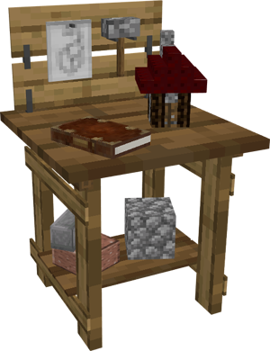
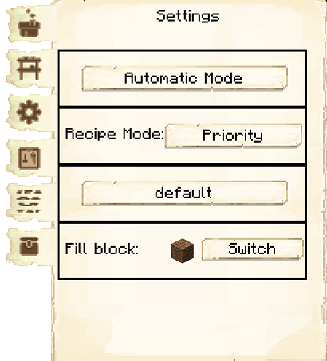
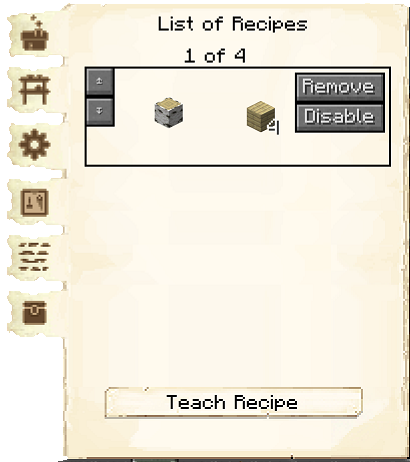
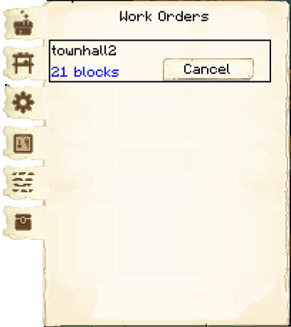
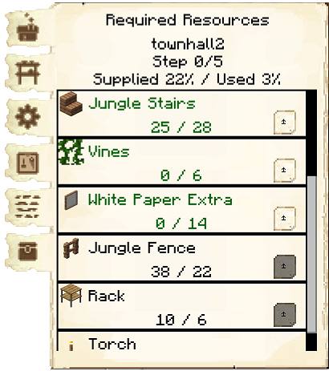

# Builder's Hut

    
    

    

        

        
<strong>Worker:</strong>

        

        

        
<a href="../workers/builder">Builder</a>

        

    

    

    <recipe>builder</recipe>

### Before you build *any* other building, you must build the Builder's Hut. If the Builder’s Hut is not built, the Builder cannot build other buildings.

Before you choose a place to build the Builder's Hut, take into account the distances among the other possible building sites and obstacles like water, trees, caves, mountains, lava sources, etc. After you have selected a place for the hut, you have to craft the Builder’s Hut block and place it with your [build tool](../items/buildtool). Once the hut is placed, the Builder will be automatically assigned (or you can manually assign one with the best [Traits](../systems/worker) for a Builder if you changed this in the settings tab in the [Town Hall's GUI](../../source/buildings/townhall).

Now you will have to issue the build assignment so the Builder can build their own hut first. The Builder will ask for the materials they need. Make sure to check the [Resource Scroll](../../source/items/resourcescroll) or the Required Resources tab of the Builder's Hut GUI to see what materials the Builder is requesting for any build/upgrade. Any material in the list that is still missing will be in red letters.

Once the Builder's Hut is built you can now build anything you want, like worker huts, buildings, decorations, or your own schematics.

- **Note:** The Builder can only build or upgrade any other hut up to the level of their own hut. So, in order for the Builder to upgrade any building, the Builder's Hut must be upgraded first. Then the Builder will be able to upgrade any other building(s).

## Builder's Hut GUI

  

  When accessing the Builder’s Hut block by right-clicking on it, you will see a GUI with different options.  You start on the main tab:

   
  

    

      
    

    

       
      <ul>
        
          <li><strong>{{ item.button }}:</strong> {{ item.content }}</li>
        
      </ul>
    

  

    
   
  

    

      
    

    

     
    
The second tab of the GUI is <strong>Minimum Stock</strong>. 

    <ul>
        <li><strong> Add: </strong> Use this button to tell the Builder's Hut to keep a minimum stock on hand. Set items will be displayed above the button.</li>
    </ul>
    

  

   
  

    

      
    

    

      
The third tab of the GUI is <strong>Settings</strong>.

      <ul>
        <li><strong>Builder Mode:</strong> Here you can set your Builder to Manual or Automatic mode (Automatic by default). In Automatic, the builder chooses which build order they'll complete next themselves (based on the order of the build requests in the <a href="../../source/buildings/townhall">Town Hall</a> GUI's <a href="#workorders">work orders</a> tab). In Manual, you choose their next build order yourself by clicking Select next to the build order's name.</li>
        <li><strong>Recipe Mode:</strong> This is unlocked by researching Warehouse Master in the University. This allows you to change the order the hut chooses when it knows more than one recipe for an item. 
          <ul>
            <li><strong>Priority:</strong> This is the default setting. The hut will try to use the recipe that is higher up in their recipe list first.</li>
            <li><strong>Warehouse Stock:</strong> The hut will look in the warehouse first to see what resource you have more of before deciding what recipe it will use.</li>
          </ul>
          
For example: the sawmill has two recipes to make chests: one using 8 oak planks, and one using 8 spruce planks. In "Priority" mode, if the oak planks recipe is higher on the list, the carpenter would always use oak planks to make chests (even if there are none left). In "Warehouse Stock" mode, the carpenter would check to see that there are more spruce planks than oak planks in the warehouse before deciding to use spruce planks to make chests.

        </li>
        <li><strong>Build Method:</strong> This is unlocked by researching Builder Modes in the University.  This allows you to change how the builder builds, reducing pathfinding and speeding up builds (especially large builds).  Any one of these can be set in the structurize config, but once the "Builder Modes" research is done in the university, the one set here takes precedence.
          <ul>
            <li><strong>default:</strong> The default row-by-row pattern.</li>
            <li><strong>inwardcircle:</strong> Blocks are placed like a square spiral from the outside in.</li>
            <li><strong>inwardcircleheight#:</strong> This will also make spirals from the outside in, but each spiral gets built upward 1 to 4 times, before the builder will start the next square inward.</li>
            <li><strong>hilbert:</strong> hilbert does <a href="https://en.wikipedia.org/wiki/Hilbert_curve" target="_blank">this pattern</a>, with a little difference to work for rectangular areas.</li>
            <li><strong>random:</strong> Blocks are placed in an entirely random order. Note that this slows down builds.</li>
          </ul>
        </li>
        <li><strong>Fill Block:</strong> Here you can select what block the builder uses to fill in holes/gaps in the schematic.  The default is the dirt block.</li>
      </ul>
    

  

   
  

    

      
    

    

      
The fourth tab of the GUI is <strong>Crafting Recipes</strong>.  Here you can see all the recipes you have taught this hut and can remove them.

      <ul>
        <li><strong>Teach Recipe:</strong> When clicking teach recipe, it opens a crafting grid which allows you to teach this hut recipes (not the worker).</li>
      </ul>
    

  

   
  

    

      
    

    

      
The fifth tab of the GUI is <strong>Work Orders</strong>.  This page shows you what buildings have been assigned to this builder, along with the distance away from the builder's hut.  You can cancel the work order here. 

    

  

   
  

    

      
    

   
  

    
The sixth tab of the GUI is <strong>Required Resources</strong>. These are the resources that the Builder will need for the build order they are currently working on. 

    <ul>
      <li><strong>Current project</strong> The top line tells you which building is being worked on and its level.</li>
      <li><strong>Step</strong> What step of the project the builder is on.</li>
      <li><strong>Supplied %/ Used %</strong> How much of the needed resources are in the builder hut inventory, and how many of the resources have been placed.</li>
      <li><strong>Item</strong> Each needed item is displayed, along with how many of that item is in inventory, and how many are needed.  These amounts will change as they place blocks and will show only what blocks the Builder still needs to place. The block in black are in their inventory.  The blocks in red are the ones neither you nor the Builder has in their inventory.  The blocks in green are ones you have in inventory but the builder needs.  Clicking the up arrow next to the item will automatically remove that item from your inventory and place it into the builder's.</li>
    </ul>
  

   
  

## Hints and Tips

For the placement of the Builder's Hut, you should consider having the hut in the middle of where you plan to have the rest of your buildings so that the Builder has less of a distance to walk between their hut and the build sites.

The Builder will not start another build assignment until they have finished the current one.

You can go into the Town Hall's GUI and click on the work orders tab to cancel builds as well as arrange the priorities of the other build orders you have there. If you cancel a work order and it was being built already, if you assign the build order again, the Builder will continue where they left off.

If the Builder removes a block while building and/or upgrading, they will keep it in their inventory and dump any items in their inventory at the end of a build into the Builder's Hut inventory.
  

