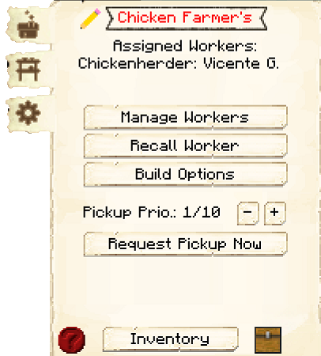
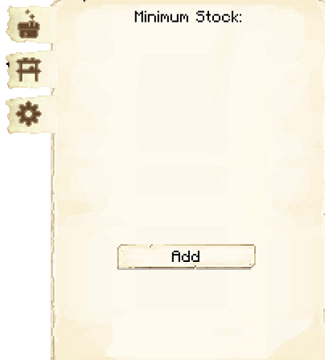

# Chicken Farmer's Hut

    
    

    

        

        
<strong>Worker:</strong>

        

        

        
<a href="../workers/chickenfarmer">Chicken Farmer</a>

        

    

    

    <recipe>chickenfarmer</recipe>

 The Chicken Farmer's Hut is where the Chicken Farmer will raise chickens, collect eggs, and butcher chickens for food. You will have to capture and bring in two chickens to the Chicken Farmer's Hut, as the Chicken Farmer will not catch and bring in any chickens.

**Note:** The Chicken Farmer will only keep two chickens alive per hut level, so at level 5 they will have ten chickens in their holding pens to breed and butcher. This means they will be faster at producing and collecting meat, drops, and other byproducts, like eggs. So:

| Building Level | Chickens Housed |
| ----- | ----- |
| 1 | 2 |
| 2 | 4 |
| 3 | 6 |
| 4 | 8 |
| 5 | 10 |  

## Chicken Farmer's Hut GUI

When accessing the Chicken Farmer's Hut block by right-clicking on it, you will see a GUI with different options:

 

  

    
  

  

     
    <ul>
      
        <li><strong>{{ item.button }}:</strong> {{ item.content }}</li>
      
    </ul>
  

  
   

 

  

    
  

  

     
    
This is page two of the GUI. It has one button:

    <ul>
        <li><b>Breeding:</b> On by default. Here you can choose if the Chicken Farmer will breed (and consequently kill) chickens or just collect eggs.</li>
    </ul>
  

  
  
   
